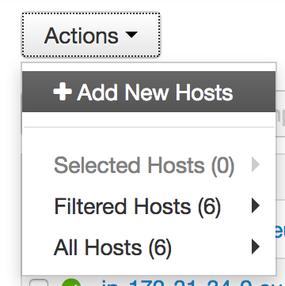

# Add a new host

How to add a new host on Ambari.

## Pre-Requisites

- To know how to launch & config EC2 instances
- OpenSSH installed or any SSH client
- an Ambari cluster already installed

## What will we do?

First we are going to create the instances we need. Then we will launch the install of Ambari Agent on Ambari.

## What will we need?

We will need **one or multiple EC2 instance(s)**, depending on your needs, using the client template. As we assume an Ambari cluster is already installed, we assume you know how to create an EC2 instance with the client template. If not, report to the document [_Create templates_](./create_templates.md).

When created and ready, let's begin!

## Add the host(s)

On the Ambari web page, go on the **Hosts** tab at the very top. On the page choose *Add New Hosts* from the *Actions* menu.

Like in the first Ambari install, provide the lists of the hosts (private DNS), the private key and change the username to `ubuntu`. Let Ambari installs the agent and then click *Next*.

On the next page, you can add clients program already installed on the cluster (HDFS, YARN, etc.), to the new hosts. This part is up to you.

Confirm with *Next*, then *Deploy*.

And that's it! You can now use the new host(s)!