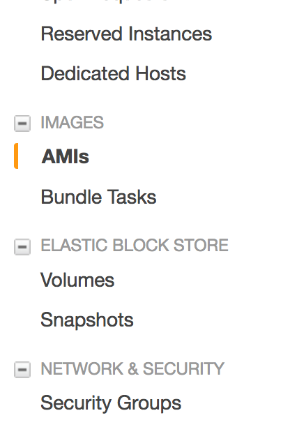

# Create templates

How to create Ambari Ambari Server and Ambari Clients template. This document is specific to AWS but the same method can be used on other cloud services such as GCP, Azure, etc.

## Pre-Requisites

- To know how to launch & config EC2 instances
- OpenSSH installed or any SSH client

## What will we do?

First we are going to create the server, that will holds Ambari and will do the provisionning, managing, monitoring and deploying of the cluster.

Then we will create a template of slave (client), that we will be able to replicate and where we will install the components.

## What will we need?

We will need **2 EC2 instances**, running **Ubuntu Server 16.04 LTS**. Don't create them now, but keep this table for future reference.

| Purpose |   Type    | Storage |
| :-----: | :-------: | :-----: |
| Server  | t2.medium |  15Gb   |
| Client  | t2.small  |  15Gb   |

## Ambari Server

Create the instance, according to the specs in the table. SSH into it and run the following commands:

```sh
# install requirements
sudo apt-get update
sudo apt-get install curl unzip openssl tar wget python ntp
# configure ntp
sudo update-rc.d ntp defaults
sudo update-rc.d ntp enable
sudo /etc/init.d/ntp start
# add the repo & update
sudo wget -O /etc/apt/sources.list.d/ambari.list http://public-repo-1.hortonworks.com/ambari/ubuntu16/2.x/updates/2.6.0.0/ambari.list
sudo apt-key adv --recv-keys --keyserver keyserver.ubuntu.com B9733A7A07513CAD
sudo apt-get update
# install the server
sudo apt-get install ambari-server
```

Confirm the download. Then launch the setup with:

```sh
sudo ambari-server setup
```

| Question                                 | Response |
| ---------------------------------------- | -------- |
| Customize user account for ambari-server daemon | n        |
| Enter choice                             | 1        |
| License                                  | y        |
| Enter advanced database configuration    | n        |

By default Ambari uses port 8080 for access to Ambari (Web and REST API). Personnaly, I prefer to use the regular web port, 80. If you wish to change the port number, you need to edit the Ambari properties file, by adding the property `client.api.port=80`:

```sh
echo "client.api.port=80" | sudo tee -a /etc/ambari-server/conf/ambari.properties
```

Finally launch the server with:

```sh
sudo ambari-server start
```

Wait that the launch complete with success.

## Ambari Client

We are going to create a template instance, that we can replicate, and dodge the painless initial setup for each client.

First, create an instance, according to the specs in the table.

SSH into it and run the following commands:

```sh
# add key and update
sudo apt-key adv --recv-keys --keyserver keyserver.ubuntu.com B9733A7A07513CAD
sudo apt-get update
# install requirements
sudo apt-get install ntp python
# configure ntp
sudo update-rc.d ntp defaults
sudo update-rc.d ntp enable
sudo /etc/init.d/ntp start
```

## SSH communication

At the moment, we can connect to the two instances/nodes but the nodes themselves cannot communicate between them. Indeed, Ambari Server communicate throught SSH. We need to allow the Ambari Server node to access to the slaves nodes (with Ambari Agents).

Also Ambari Server need a password-less SSH access to work. On the Ambari Server type the following command:

```sh
# generate keys file (public and private)
ssh-keygen -t rsa -P '' -f ~/.ssh/id_rsa
```

Now, we need to copy the public key (`id_rsa.pub`) from the Ambari Server to the template slave node. You can use the `scp` to do that. After closing the SSH connection:

```sh
scp -i key.pem ubuntu@<public DNS ambari server>:~/.ssh/id_rsa.pub .
# also copy the private key, we need it later
scp -i key.pem ubuntu@<public DNS ambari server>:~/.ssh/id_rsa .
```

Then copy this to the template slave node:

```sh
scp -i key.pem id_rsa.pub ubuntu@<public DNS slave node>:~/.ssh/
```

Finally, append the contents to `~/.ssh/authorized_keys` on the template slave node, by using:

```sh
cat ~/.ssh/id_rsa.pub >> ~/.ssh/authorized_keys
```

We now have our template. Let's create an image of this template.

Back on AWS Console, in the list of instances, select the one we just configure (our template), right-click on it and select **Create an image**.


Give an distinguish name and description to your instance and click **Create Image**. You can see your AMI (Amazon Machine Image) just like instances by clicking to **AMIs** on the left menu.



Wait until the status of your image is **available**.

And that's it! 🎉