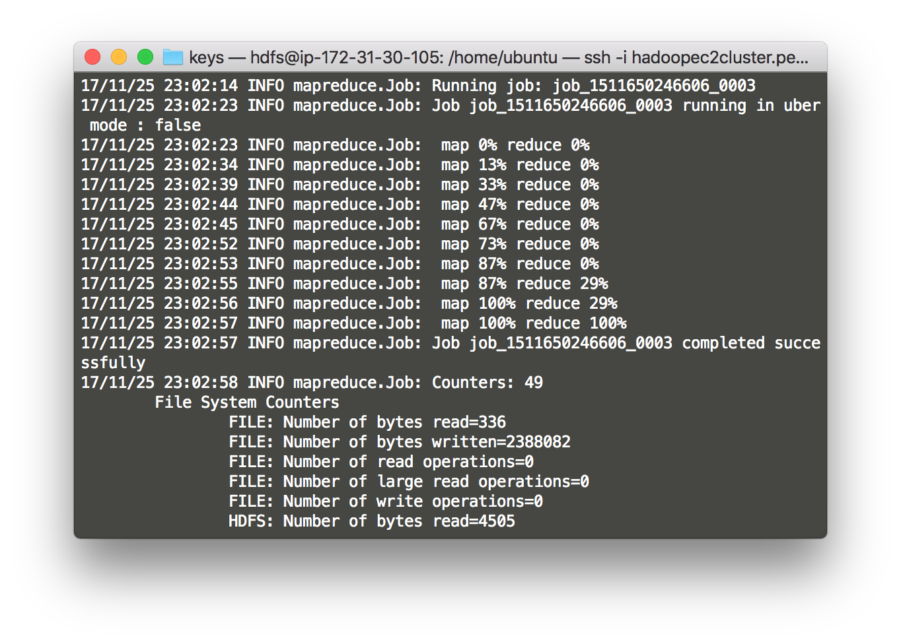
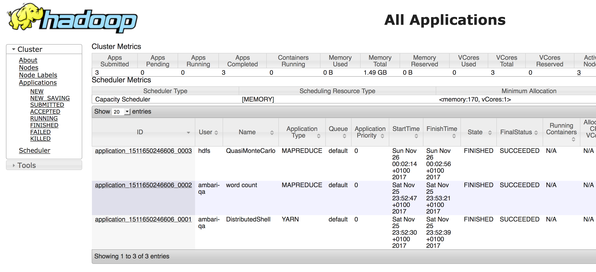

#Let's test Hadoop!

Ambari allows us to monitor and manage the services but we cannot use them throught it!

## Pre-Requisites

- Cluster install through Ambari
- OpenSSH installed or any SSH client

SSH into your master node and run the following commands to test Hadoop:

```sh
# login as root
sudo su
# login as hdfs, the user created by Ambari for HDFS
su - hdfs
# run the test example, calc pi with 15 map and 1000 samples per map
hadoop jar /usr/hdp/2.6.3.0-235/hadoop-mapreduce/hadoop-mapreduce-examples-2.7.3.2.6.3.0-235.jar pi 15 1000
```

You can then follow the job in the terminal



but also in the browser by accessing: `<public DNS master node>::8088`



*Bonus*: you can also view the job on data nodes, by accessing: `<public DNS data node::8042>`.