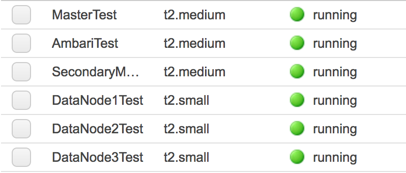
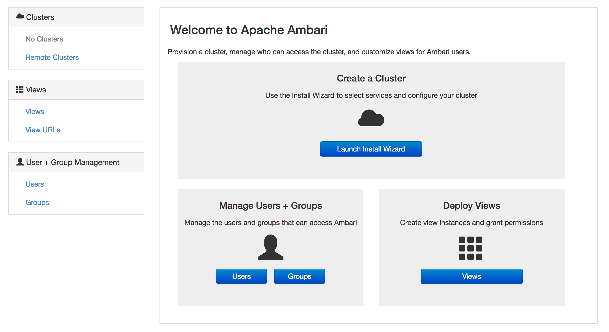
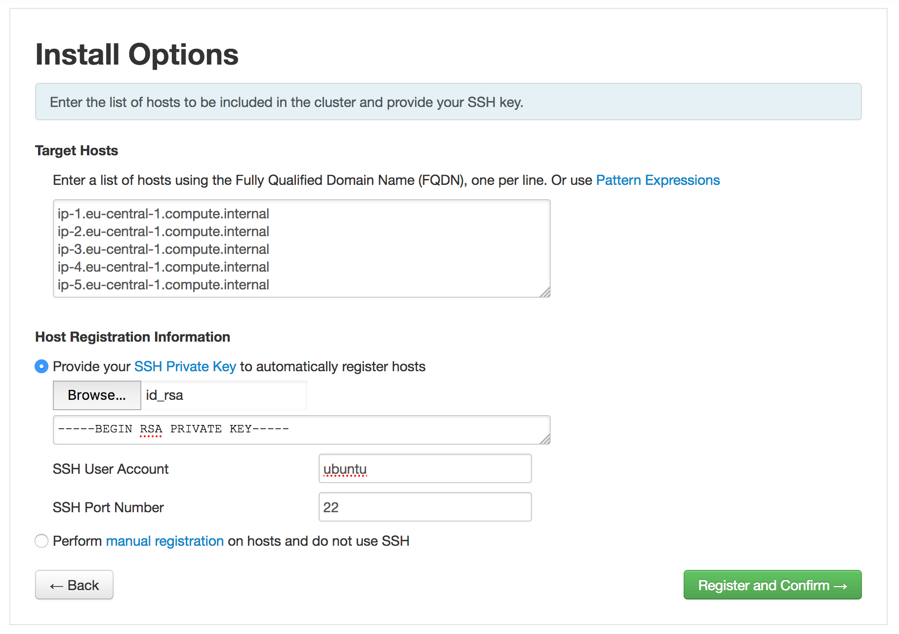
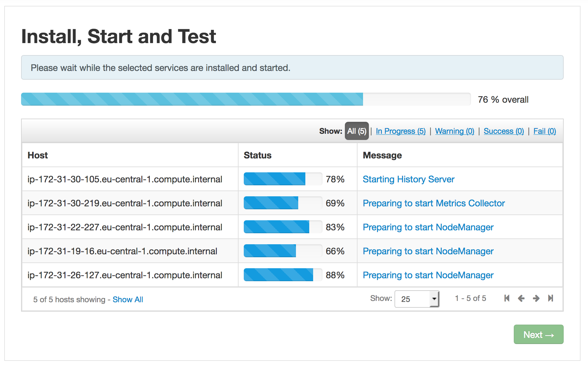
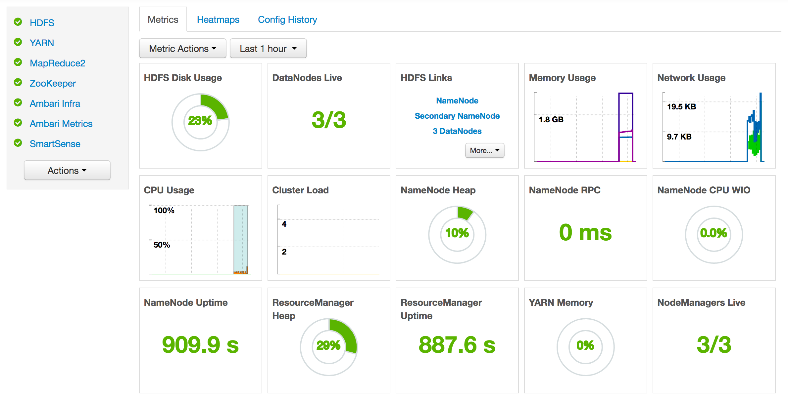

# Install Ambari

How to install Ambari on AWS and deploy/manage your Hadoop cluster.

## Pre-Requisites

- To know how to launch & config EC2 instances
- OpenSSH installed or any SSH client

## What will we do?

First we are going to create the instances we need. Then we will launch the install and config the components.

## Choose your configuration

This document offers two configuration, **the small** and **the complete**.

**The small** install the cluster with the minimum of services needed. This way you can familiarize with Ambari.

**The complete** install the cluster with all of the services we choosen for our architecture.

The following document will refer to information in additionnal section, so please use the information of the proprer document referring to the configuration you choose:

- [_The small_](./small_install.md)
- todo

## What will we need?

See the _Nodes list_ section.

Don't create them now, but keep this table for future reference.

## Create cluster

Report to the document [_Create templates_](./create_templates.md) to create the server and the client template.

Then, according to the specs in the table, create the instances we need.

You should have something like this (for the small configuration):

We have all our nodes, we can now begin the real install!

## Install the cluster

In this part, we are only going to use the browser, we are done with the terminal.

We can access the Ambari Install Wizard through the browser, to `http://<public DNS of your Ambari server>`.

We should now be on the login page of Ambari Server. Log in using the default username/password: **admin/admin**. We can change this later to whatever we wish.

Click **Launch Install Wizard**.

Choose the name of your cluster.

On the next page, **Select Version**, no need to modify anything, simply go **Next**.

On **Install Options**, we need to fill a couple of information:

- Target Hosts: enter the **private DNS** of each Ambari Client nodes, one per line
- Host Registration Information: select the private key (`id_rsa`) we downloaded before.
- SSH User Account: change to `ubuntu`

Click **Register and Confirm** to continue.

Wait during the registering process. At a couple of minutes, the status of all host should be **Success**. Click **Next**.

### Services

On the next page, we choose the services we want to install in our cluster. Don't worry we will be able to add new service after initial setup. 

Please refer to the _Services list_ section.

Click **Next** to confirm the selection.

### Masters

On the next page, we assign master components to hosts you want to run them on.

Please refer to the _Masters assignations list_ section.

When you are satisfied with the assignments, choose **Next**.

### Slaves

On the next page, we assign slave components to hosts you want to run them on.

Please refer to the _Slaves assignations list_ section.

Click **Next** to continue.

### Customize Services

This step presents a set of tabs that let us review and modify the cluster setup. It attempts to set reasonable defaults for each of the options.

**Any tab that requires input shows a red badge with the number of properties that need attention.**

Please refer to the _Customize services list_ section.

Click **Next** to continue.

### Review & install

On the next page, we can review our installation before actually doing the install. If everything looks good to you, click **Deploy**!

The progress of the install displays on the screen. Ambari installs, starts, and runs a simple test on each component. Overall status of the process displays in progress bar at the top of the screen and host-by-host status displays in the main section. **Do not refresh your browser during this process. Refreshing the browser may interrupt the progress indicators.**

When `Successfully installed and started the services` appears, choose **Next**.

On the next page, we get a summary of the deployment. Hit **Complete** to land on Ambari main page, showing metrics and global status of services!

## Autostart of services

We can configure Ambari to autostart the services automatically when started.

In Ambari web interface, go to **Admin** > **Service auto start**.

Simply **Enable all** component for each service and **Save**.

Now, when you will start your instances, Ambari will automatically boot all the services for you :tada:

## Where to go?

Report to the document [_Let's test Hadoop!_](./hadoop_test.md) to test your cluster installation.
