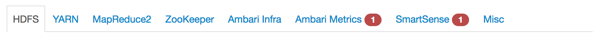

# Small install

This document contains the information used for the install of a cluster with the minimum of services. This way you can familiarize with Ambari.

## Nodes list

We will need **6 EC2 instances**, running **Ubuntu Server 16.04 LTS**.

|   Name    |              Purpose               |   Type    | Storage |
| :-------: | :--------------------------------: | :-------: | ------- |
|  Ambari   |           Ambari Server            | t2.medium | 15Gb    |
| Master #1 |   Name Node + YARN + Map Reduce    | t2.medium | 15Gb    |
| Master #2 | Secondary Name Node + Ambari Infra | t2.medium | 15Gb    |
| Client #1 |      Data Node + Node Manager      | t2.small  | 15Gb    |
| Client #2 |      Data Node + Node Manager      | t2.small  | 15Gb    |
| Client #3 |      Data Node + Node Manager      | t2.small  | 15Gb    |

## Services list

Only select the following services:

- HDFS
- YARN + MapReduce2
- ZooKeeper
- Ambari Infra
- Ambari Metrics

## Masters assignations list

I recommand to split on the two masters instances (Master and SecondaryMaster) first. We can review this assignment if needed in the future.

|          Services          |   Where   |
| :------------------------: | :-------: |
|         SNameNode          | Master #2 |
|          NameNode          | Master #1 |
| App Timeline Server (YARN) | Master #1 |
|      ResourceManager       | Master #1 |
| History Server (MapReduce) | Master #1 |
|      ZooKeeper Server      | Master #1 |
|    Infra Solr Instance     | Master #2 |
|     Metrics Collector      | Master #2 |
|          Grafana           | Master #2 |
|     Activity Analyzer      | Master #2 |
|     Activity Explorer      | Master #2 |
|         HST Server         | Master #2 |

## Slaves assignations list

I recommand to install on the three instances that we choose to be our data nodes (without the *✵* in the list), the following:

- DataNode
- NodeManager
- Client

## Customize services list

At the moment, only two services need some information from us: *Ambari Metrics* and *SmartSense*.

The tabs needing our attention, are demanding the default password of the admin account, to access this service. You can go with **admin** for both of us.

The others services are good with the default parameters, but can also need some custom. Please edit this part if further custom of these services is needed.