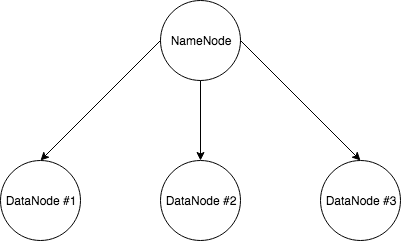

# Hadoop

## Pre-Requisites

- OpenSSH installed or any SSH client

We are going to create a simple cluster with 4 nodes: a master and three data nodes. Let's do it!



##Create a template

We are going to create a template instance, that we can replicate, and dodge the painless initial setup for each instance. Only what differ from master and slave will be left to do.

First, create an instance, with the type you want (eg:  t2.micro), running **Ubuntu Server 16.04 LTS**. 

***We will assume that this instance is the master.***

SSH into it and run the following commands.

In order to work, **each node** in the cluster **must have **Java and Hadoop installed. First Java:

```shell
sudo apt-get install default-jdk
```

Then Hadoop, download, uncompress and move it to `/usr/local/` folder.

```
wget http://apache.crihan.fr/dist/hadoop/common/hadoop-2.8.2/hadoop-2.8.2.tar.gz
sudo tar xzf hadoop-2.8.2.tar.gz 
sudo mv hadoop-2.8.2 /usr/local/hadoop
sudo chown -R ubuntu /usr/local/hadoop/
```

*Note*: why `/usr/local/`? The `/usr/local` hierarchy is use when installing software locally. It needs to be safe from being overwritten when the system software is updated. It may be used for programs and data that are shareable among a group of hosts. This is perfect for Hadoop.					

###Global configuration

Now that Hadoop is installed, we need to configure the global environment variables. Edit `~/.profile` and append the following at the end of it:

```
# Hadoop configuration
export JAVA_HOME=/usr/lib/jvm/java-1.8.0-openjdk-amd64
export PATH="PATH:JAVA_HOME/bin"
export HADOOP_HOME=/usr/local/hadoop
export PATH=PATH:HADOOP_HOME/bin
```

*Note:* change the JVM path according to yours.

Finally reload with: `. .profile `

### Hadoop cluster configuration

This section will cover the Hadoop cluster configuration. **Six main files** must be configured in order to specify to Hadoop various configuration. Here we are going to configure it to launch in a fully distributed mode (multi nodes cluster).

Each file is located in the `etc/hadoop` of the Hadoop install folder. For us the full path is : `/usr/local/hadoop/etc/hadoop`.

First modify `hadoop-env.sh`:

```
export JAVA_HOME=${JAVA_HOME}
```

to

```
export JAVA_HOME=/usr/lib/jvm/java-1.8.0-openjdk-amd64
```

### **core-site.xml**

This file contains the configuration settings for Hadoop Core (eg I/O) that are common to HDFS and MapReduce. It also informs Hadoop daemon where NameNode (the master) runs in the cluster. So each node must have this file completed.

Replace these two lines with the next block, and complete the master's private IP with your own (this instance if you remember).

```xml
<configuration>
</configuration>
```

```xml
<configuration>
    <property>
        <name>fs.default.name</name>
        <value>hdfs://<master's_private_IP>:9000</value>
    </property>
    <property>
        <name>hadoop.tmp.dir</name>
        <value>/home/ubuntu/hadooptmp</value>
        <description>A base for other temporary directories.</description>
    </property>
</configuration>
```

Don't forget to create the `/home/ubuntu/hadooptmp` folder!

### hdfs-site.xml

This file contains the configuration settings for HDFS daemons: the NameNode and the DataNodes. We can specify default block replication and permission checking on HDFS.

The *replication* value determine the number of each HDFS block being duplicated and distributed across the nodes in the cluster. Here we have 3 data nodes and we want to replicate data on each (maximum resilient) so we specify a factor of replication of 3.

The *namenode* and *datanode* folders will be created on respectively the master node and the slaves nodes.

Replace these two lines with the next block.

```xml
<configuration>
</configuration>
```

```xml
<configuration>
  <property>
    <name>dfs.replication</name>
    <value>3</value>
  </property>
  <property>
    <name>dfs.namenode.name.dir</name>
    <value>/usr/local/hadoop/hdfs/namenode</value>
  </property>
  <property>
    <name>dfs.namenode.data.dir</name>
    <value>/usr/local/hadoop/hdfs/datanode</value>
  </property>
</configuration>
```

### mapred-site.xml

This file contains the configuration settings for MapReduce daemons: the job tracker and the task-trackers.

Since MapReduce v2, YARN became the default resource management system. YARN takes care of the resource management tasks that were performed by the MapReduce in the earlier version. This allows the MapReduce engine to take care of its own task, which is processing data.

First rename `mapred-site.xml.template` to `mapred-site.xml`.

Replace these two lines with the next block, to specify YARN as the default resource management system.

```xml
<configuration>
</configuration>
```

```xml
<configuration>
    <property>
        <name>mapreduce.framework.name</name>
        <value>yarn</value>
    </property>
</configuration>
```

### yarn-site.xml

This file contains the configuration settings for YARN. Since we specify YARN as our default resource management system, we need to configure it.

The `yarn.nodemanager.aux-services` property tells NodeManagers that there will be an auxiliary service called `mapreduce.shuffle`that they need to implement. After we tell the NodeManagers to implement that service, we give it a class name as the means to implement that service. This particular configuration tells MapReduce how to do its shuffle. Because NodeManagers won’t shuffle data for a non-MapReduce job by default, we need to configure such a service for MapReduce. 

Finally, we specify the **private** IP address of the master node (still this instance), which doesn't change when the instances are restarted, so we don't have to update these files each time we start the cluster.

Replace these two lines with the next block.

```xml
<configuration>
</configuration>
```

```xml
<configuration>
  <property>
      <name>yarn.nodemanager.aux-services</name>
      <value>mapreduce_shuffle</value>
  </property>
  <property>
      <name>yarn.nodemanager.auxservices.mapreduce.shuffle.class</name>
      <value>org.apache.hadoop.mapred.ShuffleHandler</value>
  </property>
  <property>
      <name>yarn.resourcemanager.hostname</name>
      <value><master's_private_IP></value>
      <description>The hostname of the Ressource Manager.</description>
  </property>
</configuration>
```

### SSH configuration

Before creating the AMI, we still have one step to do. 

After the creation of the instances from the AMI, we will be able to connect to all our instances/nodes but the nodes themselves will not be able to communicate between them. Indeed, Hadoop and all the associate components (YARN, HDFS, etc.) communicate through SSH. We need to allow the master node (NameNode) to access to the slaves nodes (DataNode).

But accessing via SSH requires a password, so in order to avoid having to type the password for each SSH access to nodes in the cluster, we are going to set a password-less SSH access. Still on the master instance, type the following commands:

```sh
# generate keys file (public and private)
ssh-keygen -t rsa -P '' -f ~/.ssh/id_rsa
# add the public key in the list of the authorized keys
cat ~/.ssh/id_rsa.pub >> ~/.ssh/authorized_keys
# download the private key & remove it from the node
scp -i key.pem ubuntu@<public DNS>:~/.ssh/id_rsa .
rm ~/.ssh/id_rsa
```

We now have our template. You can create the image. Referer to [this document](../AWS/AMI.md) if you don't know how to do it.

Then create 3 instances and rename the instances as follow:

- HadoopNameNode (Master)
- HadoopDataNode1 (Slave #1)
- HadoopDataNode2 (Slave #2)
- HaddopDataNode3 (Slave #3)

## SSH config (again!)

As said earlier, the master node needs to communicate with the data nodes. We need to upload the private key (`id_rsa`) back on the master.

```sh
# upload the private key
scp -i key.pem id_rsa ubuntu@<public DNS master node>:~/.ssh/
```

SSH uses a configuration file located at `~/.ssh/config` for various parameters. You can find a template of this file in the **keys** folder. Set it up by substitute each node’s *Private DNS* for the HostName parameter.

Why *Private DNS* instead of *Public DNS*? *Public DNS* changes every time you stop and then start your instance. *Private DNS* doesn't. Thanks to this trick communication will work even after stop/start.

To enable simple instances interaction, we are going to add a quick *config* file. 

You can find a template of this file (`config.template`) in the **template** folder. Simply rename it to `config` and replace, for each `Host` in the file:

- the `internal_ip_address` with the actual *Private DNS*
- (optional) the path of the private key  (`id_rsa`) if needed.

To try, from the NameNode (master), simply: `ssh datanode1` and that's it!

## Hadoop config

The following file have to be created in `/usr/local/hadoop/etc/hadoop`.

### masters

This file defines on which machines run the NameNode in our multi-node cluster. This is also here where we add the secondary NameNode.

**On the master (NameNode) :** create the `masters` file and add the master's private IP in it.

**On the slaves (DataNode) :** create the `masters` file but lets it **empy**.

###slaves

This file defines on which machines run the DataNodes in our multi-node cluster.

**On the master (NameNode) :** create the `slaves` file and add the slaves's private IP in it, one per line, as a list.

**On the slaves (DataNode) :** create the `slaves` file and add the slave's private IP of the current slave node.

## Formating HDFS

After all that configuration, it is now time to test drive the cluster. First, we need to format the HDFS file system on the NameNode. For the HDFS NameNode to start, it needs to initialize the directory  where it will hold its data. The format process will use the value assigned to `dfs.namenode.name.dir` in `etc/hadoop/hdfs-site.xml` earlier. Formatting destroys everything in the directory and sets up a new file 
system.

```sh
/usr/local/hadoop/bin/hdfs namenode -format
```

**Do this only once!**

If everything is good, should end with `Exiting with status 0` and `Shutting down NameNode`.

## Starting the cluster

Once formatting is successful, the HDFS and YARN services must be started.

```sh
/usr/local/hadoop/sbin/start-dfs.sh 
/usr/local/hadoop/sbin/start-yarn.sh 
```

And to stop them:

```
/usr/local/hadoop/sbin/stop-yarn.sh 
/usr/local/hadoop/sbin/stop-dfs.sh
```

To test if everything is good, on each node use the command `jps`. On master node, you will see master's process and on data nodes, you will see data's process.

## Run the test program

To test the installation, we can run the sample “pi” program that calculates the value of pi using a quasi-Monte Carlo method and MapReduce. The program takes two arguments, the number maps and the number of samples and submits a MapReduce job to YARN. Here an example:

```sh
hadoop jar /usr/local/hadoop/share/hadoop/mapreduce/hadoop-mapreduce-examples-2.8.2.jar pi 10 1000
```

You can also follow the job on the webpage. If the program worked correctly, the following should be displayed at the end of the program output stream:

```
Estimated value of Pi is 3.14250000000000000000
```

The JAR file contains several sample applications to test the YARN installation. Simply use the following command to the full list:

```sh
hadoop jar /usr/local/hadoop/share/hadoop/mapreduce/hadoop-mapreduce-examples-2.8.2.jar
```

You can then follow the job in the terminal


but also in the browser by accessing: `<public DNS master node>::8088`


*Bonus*: you can also view the job on data nodes, by accessing: `<public DNS data node::8042>`.