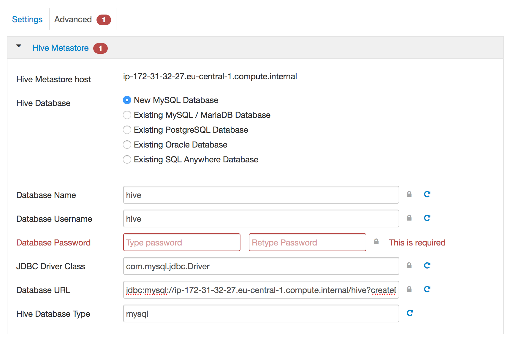

# Ambari Install - Customize Hive

While installing Hive on Ambari, you'll need to provide information and modify some. At the moment only on Hive Metastore.

#Hive Metastore

**Database Password**: we recommand to use a strong password, that you keep safely elsewhere. If you just want to try, use a simple password, such as `hive`

**Database URL**: Ambari replace the address of the server using the private DNS. But Hive doesn't know how to use it, so he will not be able to reach the database. To fix it, replace the private DNS with `localhost` , so the full URL is:  `jdbc:mysql://localhost/hive?createDatabaseIfNotExist=true`

