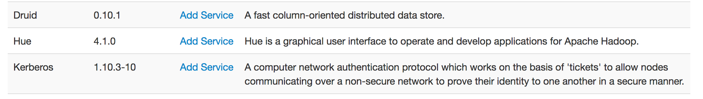
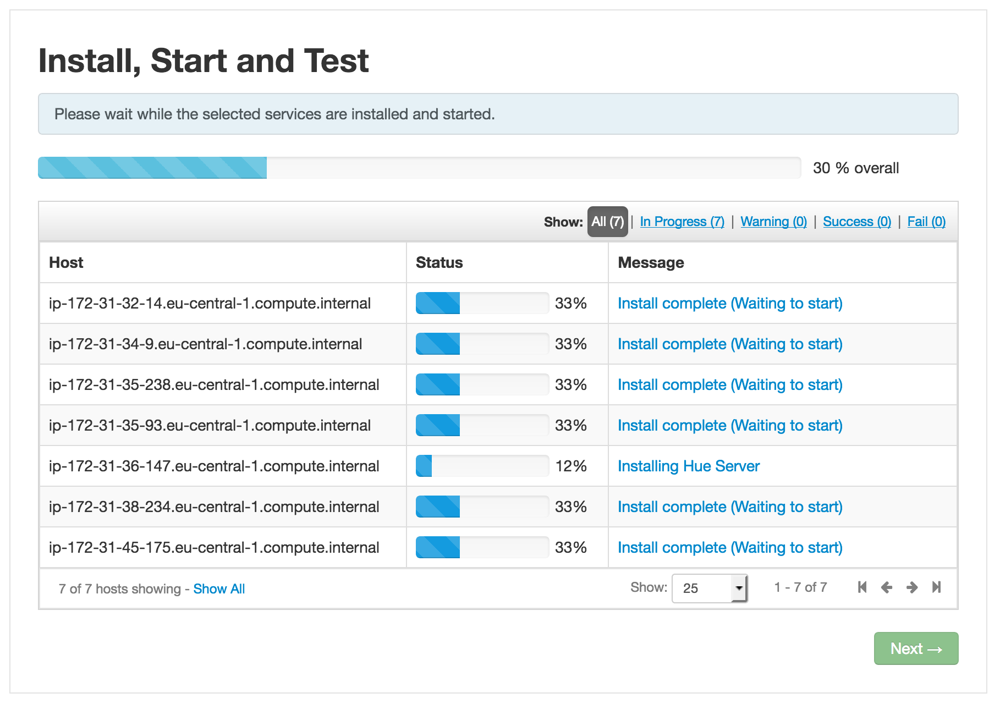

# Install Hue

How to install Hue service on Ambari.

## Pre-Requisites

- To know how to launch & config EC2 instance
- OpenSSH installed or any SSH client

## What will we do?

First we are going to add a new service to Ambari, and config the components of the cluster (HDFS, Oozie, etc.), so they can interact with the new components. Then we will add a new host, on which we will install the new service.

## Add the service to Ambari

SSH into the **Ambari Server** and run the following commands:

```shell
# clone the repo
git clone -b master https://github.com/gaelfoppolo/self-service-data-analytics
# copy the custom Hue service
sudo cp -R self-service-data-analytics/bin/ambari-hue-service/ /var/lib/ambari-server/resources/stacks/HDP/2.6/services/HUE
# remove the folder
rm -rf self-service-data-analytics
# restart the server
sudo ambari-server restart
```

We also need to fix the encoding:

```shell
sudo sed -i "1s;^;import sys\nreload(sys)\nsys.setdefaultencoding('utf-8')\n;" /usr/lib/python2.6/site-packages/resource_management/core/sudo.py
```

## Configuration

In this part, we are only going to use the browser, we are done with the terminal.

### HDFS

Go to Ambari, choose the HDFS service, tab _Configs_, subtab _Advanced_.

#### WebHDFS

In the section _General_, ensure WebHDFS is enabled.

#### Proxy user

In the section _Custom core-site_ section. Add the following properties by clicking on _Add Property_ at the bottom:

```xml
hadoop.proxyuser.hue.groups=*
hadoop.proxyuser.hue.hosts=*
```

#### ACLS (optional)

In the section _Custom hdfs-site_ section. Add the following properties by clicking on _Add Property_ at the bottom:

```xml
dfs.namenode.acls.enabled=true
```

Save the new configuration, giving proper notes, such as "Add config to support Hue". You will need to restart some service, as Ambari will prompt you, wait until you configure all the others services to restart them.

### Oozie

Go to Ambari, choose the Oozie service, tab _Configs_, subtab _Advanced_.

#### Proxy user

In the section _Custom oozie-site_ section. Add the following properties by clicking on _Add Property_ at the bottom:

```xml
oozie.service.ProxyUserService.proxyuser.hue.groups=*
oozie.service.ProxyUserService.proxyuser.hue.hosts=*
```

Save the new configuration, giving proper notes, such as "Add config to support Hue".

### Hive

Go to Ambari, choose the Hive service, tab _Configs_, subtab _Advanced_.

#### Proxy user

In the section _Custom webhchat-site_ section. Add the following properties by clicking on _Add Property_ at the bottom:

```xml
webhcat.proxyuser.hue.groups=*
webhcat.proxyuser.hue.hosts=*
```

Save the new configuration, giving proper notes, such as "Add config to support Hue".

You can now restart all the services that need it.

## Install the Hue service

We need to create and add a new host where we will install Hue server. Here its characteristics: 

- type **t2.medium**
- with **15Gb** of storage

Report to the document [_Add a new host_](../Ambari/add_new_host.md) to add a new host to Ambari.

When done, head to the *Admin > Stack and Versions* tab, scroll until you find **Hue** and click on *Add Service*.



Nothing to modify on the first page, click *Next*.

Next page, assign the **Hue Server** (should be at the bottom), to the new host you just added. Hit *Next*.

On the next page, you can custome the service.

### Hue User Info

We recommand to enable *User Sync*.

### Hue Service Module

Activate the modules that are installed on your cluster.

### Advanced 

This tab allows you to modify settings of Hue, such as HTTP port. You can leave it as it is, or modify as you wish.

Hit *Next*, then *Deploy*. Wait while Hue is being installed! 

**This process can take several minutes, the wizard downloading and building the service before the installation!**



When `Successfully installed and started the services` appears, choose **Next** and then **Complete**.

You can now restart all the services that need it, from the landing page of Ambari.

_Note: don't forget to enable autostart of Hue service in **Admin** > **Service auto start**_

