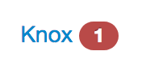
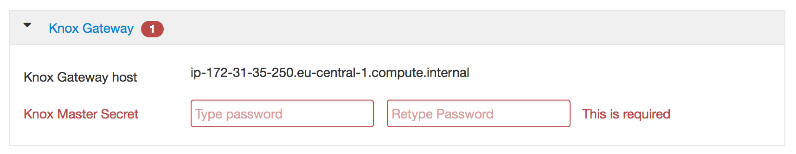

# Ambari Install - Customize Knox

While installing Knox on Ambari, you'll need to provide information and modify some. At the moment only on Knox Gateway.

# Knox Gateway

**Database Password**: we recommand to use a strong password, that you keep safely elsewhere. If you just want to try, use a simple password, such as `knox`

