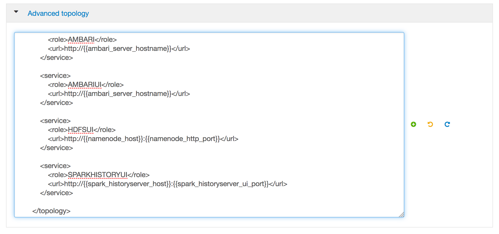

# Add support to a new service

Apache Knox Gateway supports numerous Hadoop services in both Kerberized and Non-Kerberized clusters, such as YARN or Oozie.

However, we decided to use HDP (Horthonworks) stack and all of the services developed and tested by the Apache Knox community are not officially supported by Hortonworks. These features are excluded for a variety of reasons, including insufficient reliability or incomplete test case coverage, declaration of non-production readiness by the community at  large, and feature deviation from Hortonworks best practices. **It's strongly recommand to not use these features in your production environments.**

## Pre-Requisites

- OpenSSH installed or any SSH client
- an Ambari cluster already installed, with Knox fully operational

## Add a service

The services are listed below, with two blocks: the first describe the service, the second the link(s) to access it.

To add a service, it's super easy: go to Ambari, _Knox > Configs > Advanced topology_.

Scroll to the end of it, and after the last `</service>` add the service you want, for example `Ambari UI`, using the content of the first block.



Save the configuration. You will be ask to restart Knox service. After restarted, you can test the access with the URL(s) of the second block, by replacing `<public DNS Knox>` . That's it!

### Ambari API

```
	<service>
    	<role>AMBARI</role>
        <url>http://{{ambari_server_hostname}}</url>
    </service>
```

```
https://<public DNS Knox>:8443/gateway/default/ambari/api/v1/clusters/testV7?format=blueprint
```

### Ambari UI

```
    <service>
        <role>AMBARIUI</role>
        <url>http://{{ambari_server_hostname}}</url>
    </service>
```

```
https://<public DNS Knox>:8443/gateway/default/ambari/
```

### HDFS UI

```
    <service>
        <role>HDFSUI</role>
        <url>http://{{namenode_host}}:{{namenode_http_port}}</url>
    </service>
```

```
https://<public DNS Knox>:8443/gateway/default/hdfs/
```

### Oozie UI

```
    <service>
        <role>OOZIEUI</role>
        <url>http://{{oozie_server_host}}:{{oozie_server_port}}/oozie</url>
    </service>
```

```
https://<public DNS Knox>:8443/gateway/default/oozie/
```

### JobHistory UI

```
    <service>
        <role>JOBHISTORYUI</role>
        <url>http://{{mr_historyserver_address}}</url>
    </service>
```

```
https://<public DNS Knox>:8443/gateway/default/jobhistory/
```

### YARN UI

```
    <service>
        <role>YARNUI</role>
        <url>http://{{rm_host}}:{{rm_port}}</url>
    </service>
```

```
https://<public DNS Knox>:8443/gateway/default/yarn/
https://<public DNS Knox>:8443/gateway/default/yarn/stacks
https://<public DNS Knox>:8443/gateway/default/yarn/logs
https://<public DNS Knox>:8443/gateway/default/yarn/jmx
```

### SparkHistory UI

```
    <service>
        <role>SPARKHISTORYUI</role>
        <url>http://{{spark_historyserver_host}}:{{spark_historyserver_ui_port}}</url>
    </service>
```

```
https://<public DNS Knox>:8443/gateway/default/sparkhistory
```

### HBase UI

```
    <service>
        <role>HBASEUI</role>
        <url>http://{{hbase_master_host}}:{{hbase_master_ui_port}}</url>
    </service>
```

```
https://<public DNS Knox>:8443/gateway/default/hbase/webui/
```

## Useful links

https://knox.apache.org/books/knox-0-14-0/user-guide.html