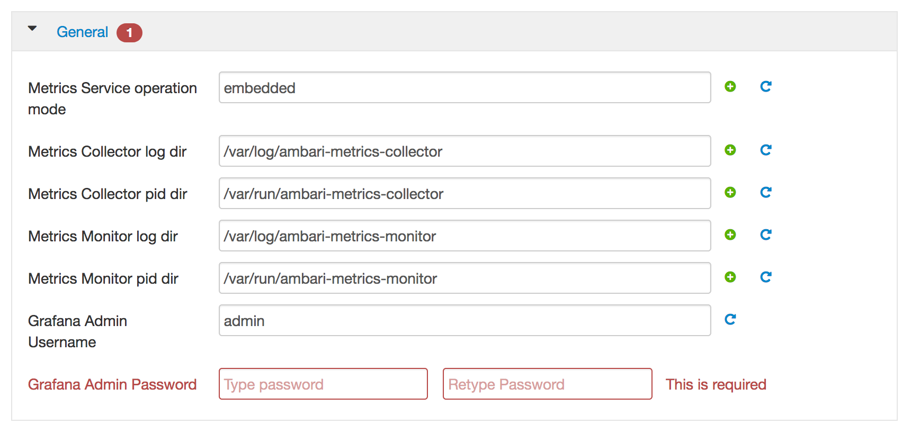

# Ambari Install - Customize Ambari Metrics

While installing Ambari Metrics on Ambari, you'll need to provide information and modify some. At the moment only on Grafana.

# Grafana

**Grafana Admin Password**: we recommand to use a strong password, that you keep safely elsewhere. If you just want to try, use a simple password, such as `admin`

