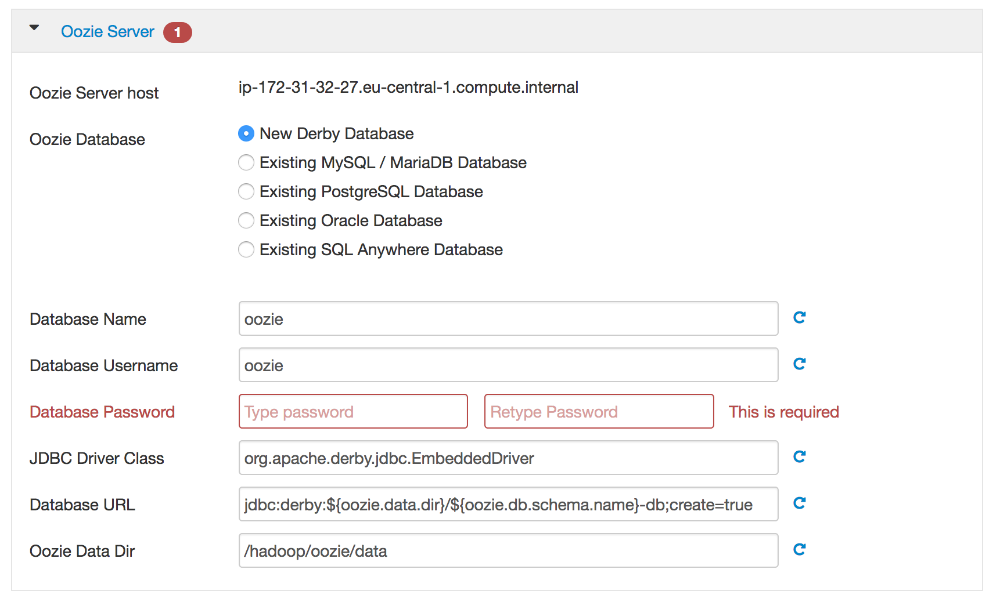

# Ambari Install - Customize Oozie

While installing Oozie on Ambari, you'll need to provide information and modify some. At the moment only on Oozie Server.

# Oozie Server

**Database Password**: we recommand to use a strong password, that you keep safely elsewhere. If you just want to try, use a simple password, such as `oozie`

