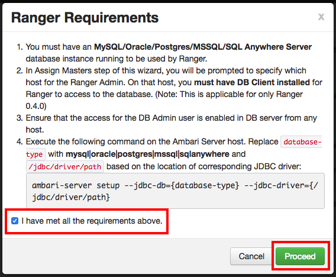

# Add Ranger using Ambari

Apache Ranger can be installed either manually using the Hortonworks Data Platform (HDP) or the Ambari User Interface (UI). Unlike the manual installation process, which requires you to perform a number of installation steps, installing Ranger using the Ambari UI is simpler and easier.

## Pre-Requisites

- OpenSSH installed or any SSH client
- an Ambari cluster already installed

## Set up the database

### On the Ranger host

First we need to install the database that will store the information of Ranger. **Here we choose MySQL, but it also work with PostgreSQL and Oracle.**

SSH to the Ranger host and install MySQL server:

```sh
sudo apt-get install mysql-server -y
```

You will be ask to enter the password of the root account for MySQL, choose wisely and write it down, you will need it later.

### On the Ambari host

You'll need to setup the Ambari Server to point it to the MySQL connector.

First, SSH to the Ambari host and if check the connector exists:

```
ls /usr/share/java/mysql.jar
```

If not, download it:

```sh
sudo apt-get install libmysql-java
```

Then, run the following on Ambari Server:

```
sudo ambari-server setup --jdbc-db=mysql --jdbc-driver=/usr/share/java/mysql.jar
```

## Add the service

Head to the *Admin > Stack and Versions* tab, scroll until you find **Ranger** and click on *Add Service*.

The Ranger Requirements page appears. We have met all of the installation requirements, so select the "I have met all the requirements above" check box and click **Proceed**.



You are then prompted to select the host where Ranger will be installed.

Assign the **Ranger Admin** et **Ranger Usersync** to the host you choose below. Hit *Next*.

On the next page, you can custom the services.

###Ranger Admin

- DB FLAVOR: MySQL
- Ranger DB Host : localhost
- Ranger DB password : ranger
- Database Administrator (DBA) password: the same password used we you setup the MySQL server

At the bottom of the page, you can check the connection.

### Ranger Audit

- SolrCloud: switch to On

### Ranger Plugin

Activate all except Kafka