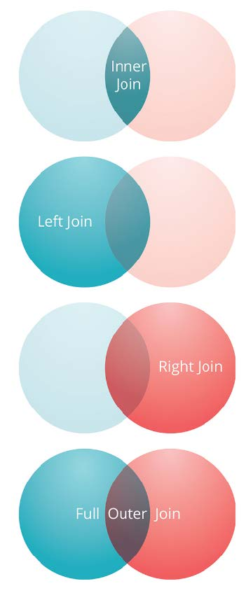

## HiveQL

The Hive Query Language (HiveQL) is a query language for Hive to process and analyze structured data in a Metastore. Given bellow is the syntax of the SELECT query: 

```
SELECT [ALL | DISTINCT] select_expr, select_expr, ... 
FROM table_reference 
[WHERE where_condition] 
[GROUP BY col_list] 
[HAVING having_condition] 
[CLUSTER BY col_list | [DISTRIBUTE BY col_list] [SORT BY col_list]] 
[LIMIT number];
```

We will now describe each constraint individually with example.

### SELECT WHERE

WHERE clause works similar to a condition. It filters the data using the condition and gives you a finite result.

Let's use the table shown below as an example.

```powershell
+------+--------------+-------------+-------------------+--------+
| ID   | Name         | Salary      | Designation       | Dept   |
+------+--------------+-------------+-------------------+--------+
|1201  | Gopal        | 45000       | Technical manager | TP     |
|1202  | Manisha      | 45000       | Proofreader       | PR     |
|1203  | Masthanvali  | 40000       | Technical writer  | TP     |
|1204  | Krian        | 40000       | Hr Admin          | HR     |
|1205  | Kranthi      | 30000       | Op Admin          | Admin  | 
+------+--------------+-------------+-------------------+--------+
```

We will try to find the employee that have a salary above 30 000.

```
hive> SELECT * FROM employee WHERE salary>30000;
```

And the results are :

```powershell
+------+--------------+-------------+-------------------+--------+
| ID   | Name         | Salary      | Designation       | Dept   |
+------+--------------+-------------+-------------------+--------+
|1201  | Gopal        | 45000       | Technical manager | TP     |
|1202  | Manisha      | 45000       | Proofreader       | PR     |
|1203  | Masthanvali  | 40000       | Technical writer  | TP     |
|1204  | Krian        | 40000       | Hr Admin          | HR     |
+------+--------------+-------------+-------------------+--------+
```

### SELECT ORDER BY

The ORDER BY clause is used to retrieve the details based on one column and sort the result set by ascending or descending order.

Let's use the table shown below as an example.

```powershell
+------+--------------+-------------+-------------------+--------+
| ID   | Name         | Salary      | Designation       | Dept   |
+------+--------------+-------------+-------------------+--------+
|1201  | Gopal        | 45000       | Technical manager | TP     |
|1202  | Manisha      | 45000       | Proofreader       | PR     |
|1203  | Masthanvali  | 40000       | Technical writer  | TP     |
|1204  | Krian        | 40000       | Hr Admin          | HR     |
|1205  | Kranthi      | 30000       | Op Admin          | Admin  | 
+------+--------------+-------------+-------------------+--------+
```

We will try to order the employee by their department name.

```powershell
hive> SELECT Id, Name, Dept FROM employee ORDER BY DEPT;
```

And the results are :

```powershell
+------+--------------+-------------+-------------------+--------+
| ID   | Name         | Salary      | Designation       | Dept   |
+------+--------------+-------------+-------------------+--------+
|1205  | Kranthi      | 30000       | Op Admin          | Admin  |
|1204  | Krian        | 40000       | Hr Admin          | HR     |
|1202  | Manisha      | 45000       | Proofreader       | PR     |
|1201  | Gopal        | 45000       | Technical manager | TP     |
|1203  | Masthanvali  | 40000       | Technical writer  | TP     |
+------+--------------+-------------+-------------------+--------+
```

### SELECT GROUP BY

The GROUP BY clause is used to group all the records in a result set using a particular collection column. It is used to query a group of records.

Let's use the table shown below as an example.

```powershell
+------+--------------+-------------+-------------------+--------+ 
| ID   | Name         | Salary      | Designation       | Dept   |
+------+--------------+-------------+-------------------+--------+ 
|1201  | Gopal        | 45000       | Technical manager | TP     | 
|1202  | Manisha      | 45000       | Proofreader       | PR     | 
|1203  | Masthanvali  | 40000       | Technical writer  | TP     | 
|1204  | Krian        | 45000       | Proofreader       | PR     | 
|1205  | Kranthi      | 30000       | Op Admin          | Admin  |
+------+--------------+-------------+-------------------+--------+
```

We will try to get the number of employee in each department (group employee by department name).

```powershell
hive> SELECT Dept, count(*) FROM employee GROUP BY DEPT;
```

And the results are :

```powershell
+------+--------------+ 
| Dept | Count(*)     | 
+------+--------------+ 
|Admin |    1         | 
|PR    |    2         | 
|TP    |    2         | 
+------+--------------+
```

### SELECT JOIN

JOIN is a clause that is used for combining specific fields from two tables by using values common to each one. It is used to combine records from two or more tables in the database. It is more or less similar to SQL JOIN.

Let's use the tables shown below as an example.

The table customer :

```powershell
+----+----------+-----+-----------+----------+ 
| ID | NAME     | AGE | ADDRESS   | SALARY   | 
+----+----------+-----+-----------+----------+ 
| 1  | Ramesh   | 32  | Ahmedabad | 2000.00  |  
| 2  | Khilan   | 25  | Delhi     | 1500.00  |  
| 3  | kaushik  | 23  | Kota      | 2000.00  | 
| 4  | Chaitali | 25  | Mumbai    | 6500.00  | 
| 5  | Hardik   | 27  | Bhopal    | 8500.00  | 
| 6  | Komal    | 22  | MP        | 4500.00  | 
| 7  | Muffy    | 24  | Indore    | 10000.00 | 
+----+----------+-----+-----------+----------+
```

and the table order :

```powershell
+-----+---------------------+-------------+--------+ 
|OID  | DATE                | CUSTOMER_ID | AMOUNT | 
+-----+---------------------+-------------+--------+ 
| 102 | 2009-10-08 00:00:00 |           3 | 3000   | 
| 100 | 2009-10-08 00:00:00 |           3 | 1500   | 
| 101 | 2009-11-20 00:00:00 |           2 | 1560   | 
| 103 | 2008-05-20 00:00:00 |           4 | 2060   | 
+-----+---------------------+-------------+--------+
```

There is four type of join :



#### Inner Join :

This join will get the id client, the client name , the client age and the amount of order 

```powershell
hive> SELECT c.ID, c.NAME, c.AGE, o.AMOUNT 
FROM CUSTOMERS c JOIN ORDERS o 
ON (c.ID = o.CUSTOMER_ID);
```

and the results are :

```powershell
+----+----------+-----+--------+ 
| ID | NAME     | AGE | AMOUNT | 
+----+----------+-----+--------+ 
| 3  | kaushik  | 23  | 3000   | 
| 3  | kaushik  | 23  | 1500   | 
| 2  | Khilan   | 25  | 1560   | 
| 4  | Chaitali | 25  | 2060   | 
+----+----------+-----+--------+
```

#### Left Join :

The HiveQL LEFT OUTER JOIN returns all the rows from the left table, even if there are no matches in the right table. This means, if the ON clause matches 0 (zero) records in the right table, the JOIN still returns a row in the result, but with NULL in each column from the right table.

A LEFT JOIN returns all the values from the left table, plus the matched values from the right table, or NULL in case of no matching JOIN predicate.

this left join will get the id client, the client name , the amount of order and the order date

```powershell
hive> SELECT c.ID, c.NAME, o.AMOUNT, o.DATE 
FROM CUSTOMERS c 
LEFT OUTER JOIN ORDERS o 
ON (c.ID = o.CUSTOMER_ID);
```

and the results are :

```powershell
+----+----------+--------+---------------------+ 
| ID | NAME     | AMOUNT | DATE                | 
+----+----------+--------+---------------------+ 
| 1  | Ramesh   | NULL   | NULL                | 
| 2  | Khilan   | 1560   | 2009-11-20 00:00:00 | 
| 3  | kaushik  | 3000   | 2009-10-08 00:00:00 | 
| 3  | kaushik  | 1500   | 2009-10-08 00:00:00 | 
| 4  | Chaitali | 2060   | 2008-05-20 00:00:00 | 
| 5  | Hardik   | NULL   | NULL                | 
| 6  | Komal    | NULL   | NULL                | 
| 7  | Muffy    | NULL   | NULL                | 
+----+----------+--------+---------------------+
```

#### Right Join :

The HiveQL RIGHT OUTER JOIN returns all the rows from the right table, even if there are no matches in the left table. If the ON clause matches 0 (zero) records in the left table, the JOIN still returns a row in the result, but with NULL in each column from the left table.

A RIGHT JOIN returns all the values from the right table, plus the matched values from the left table, or NULL in case of no matching join predicate.

this right join will get the id client, the client name , the amount of order and the order date :

```powershell
hive> SELECT c.ID, c.NAME, o.AMOUNT, o.DATE 
FROM CUSTOMERS c 
RIGHT OUTER JOIN ORDERS o 
ON (c.ID = o.CUSTOMER_ID);
```

and the results are :

```powershell
+------+----------+--------+---------------------+ 
| ID   | NAME     | AMOUNT | DATE                | 
+------+----------+--------+---------------------+ 
| 3    | kaushik  | 3000   | 2009-10-08 00:00:00 | 
| 3    | kaushik  | 1500   | 2009-10-08 00:00:00 | 
| 2    | Khilan   | 1560   | 2009-11-20 00:00:00 | 
| 4    | Chaitali | 2060   | 2008-05-20 00:00:00 | 
+------+----------+--------+---------------------+
```

#### Full Outer Join :

The HiveQL FULL OUTER JOIN combines the records of both the left and the right outer tables that fulfil the JOIN condition. The joined table contains either all the records from both the tables, or fills in NULL values for missing matches on either side.

this Full Outer join will get the id client, the client name , the amount of order and the order date :

```powershell
hive> SELECT c.ID, c.NAME, o.AMOUNT, o.DATE 
FROM CUSTOMERS c 
FULL OUTER JOIN ORDERS o 
ON (c.ID = o.CUSTOMER_ID);
```

and the results are :

```powershell
+------+----------+--------+---------------------+ 
| ID   | NAME     | AMOUNT | DATE                | 
+------+----------+--------+---------------------+ 
| 1    | Ramesh   | NULL   | NULL                | 
| 2    | Khilan   | 1560   | 2009-11-20 00:00:00 | 
| 3    | kaushik  | 3000   | 2009-10-08 00:00:00 | 
| 3    | kaushik  | 1500   | 2009-10-08 00:00:00 | 
| 4    | Chaitali | 2060   | 2008-05-20 00:00:00 | 
| 5    | Hardik   | NULL   | NULL                | 
| 6    | Komal    | NULL   | NULL                |
| 7    | Muffy    | NULL   | NULL                |  
| 3    | kaushik  | 3000   | 2009-10-08 00:00:00 | 
| 3    | kaushik  | 1500   | 2009-10-08 00:00:00 | 
| 2    | Khilan   | 1560   | 2009-11-20 00:00:00 | 
| 4    | Chaitali | 2060   | 2008-05-20 00:00:00 | 
+------+----------+--------+---------------------+
```