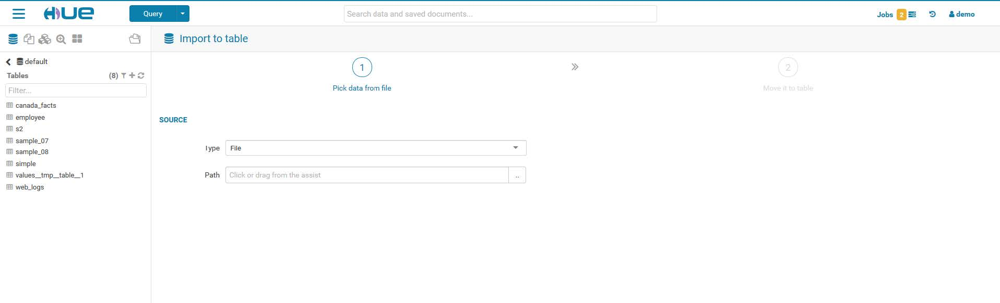
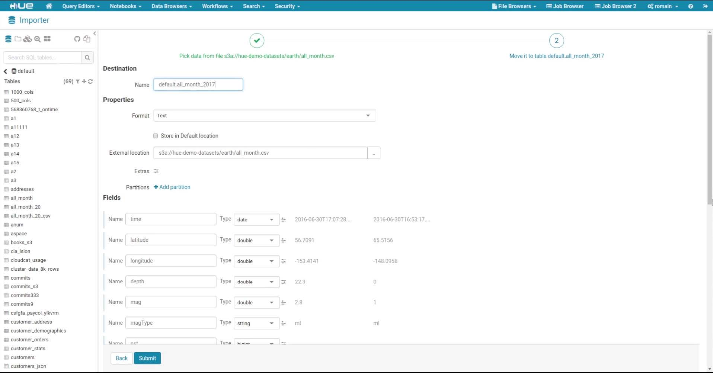
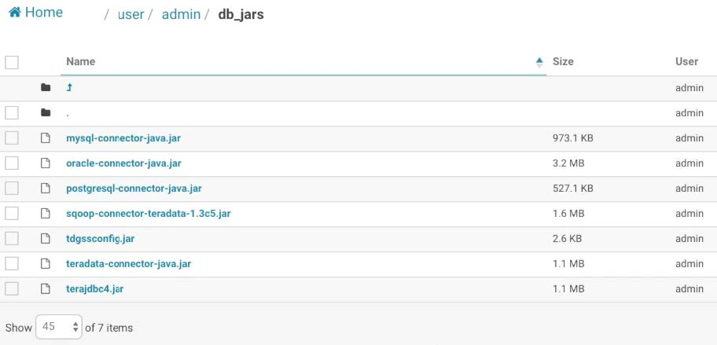
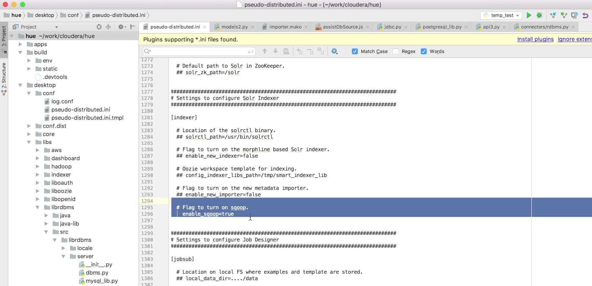
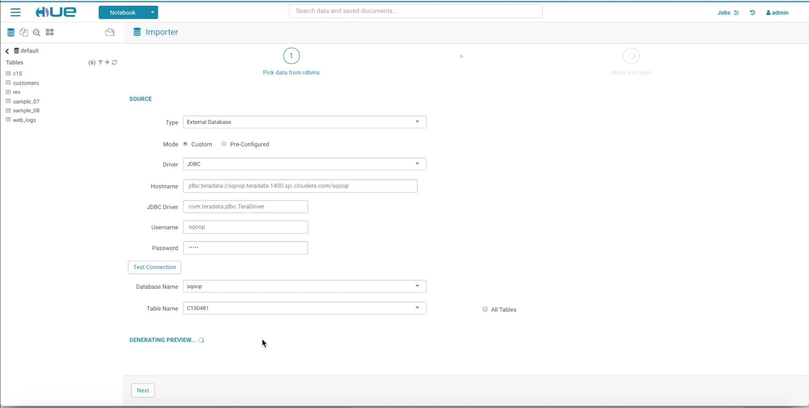
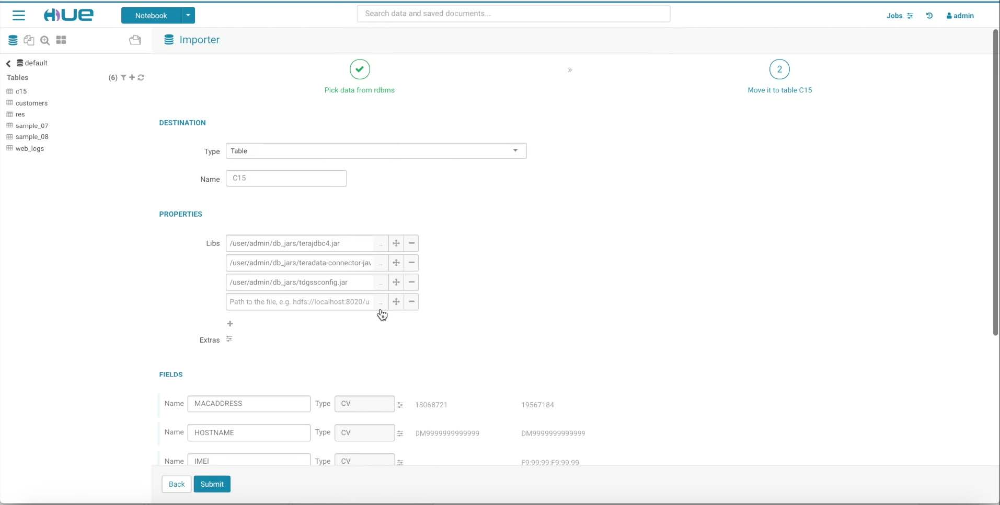

# Data importation

------

If you want to import your own data open the importer from the left menu or from the little `+` in the left assist. The wizard for creating the tables has only two simple steps :

## From a file

1. Select a source type
   ​
   

   You can either create a table from a file in HDFS or manually. When you have found your file, the wizard will generate a preview of the table.
   Click next 

2. Select the type of object for the destination

   You will see your table with the format that you wish for the destination and all the fields. You can modify, add or delete some to the table.

   

## Manually

If you want to do it **manually** you have to follow this steps :

1. In the Importer Manager selects 'Manually'

2. Follow the instructions in the wizard to create the table. The basic steps are:  

   ​

   - Name the table.
   - Choose the record format.
   - Configure record serialization by specifying delimiters for columns, collections, and map keys.
   - Choose the file format.
   - Specify the location for your table's data.
   - Specify the columns, providing a name and selecting the type for each column.
   - Specify partition columns, providing a name and selecting the type for each column.

## From relational databases

You can also import data from classic **relational databases** into HDFS file or Hive table, Squoop lets us do it. The Hue Sqoop connector comes with an import wizard. The imports run on YARN and are scheduled by Oozie.

First you must that you have some specific jar files somewhere in your HDFS :

Then in the ini file you must check that squoop is enabled :

Then go to the importer wizard and select external database as source, there will be two options "Custom" or "Pre-Configured". The second one will let you import databases that are templated by Hue and the first let you import pretty much any databases.

For the Custom import you have to fill the required information to see all the text fields.

The next page is the destination page like we previously seen for the table creation. You can chose to import the database as a file in HDFS or a table in Hive. You will need to upload all the libraries that we checked in the first steps.

Once you are all done you can click on submit. By clicking on submit the wizard will create a sqoop runned on YARN and scheduled Oozie. You can follow the job progression in the jobs tracker on the top left of the interface.