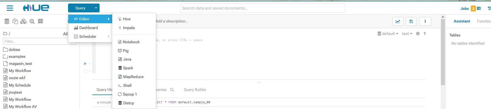
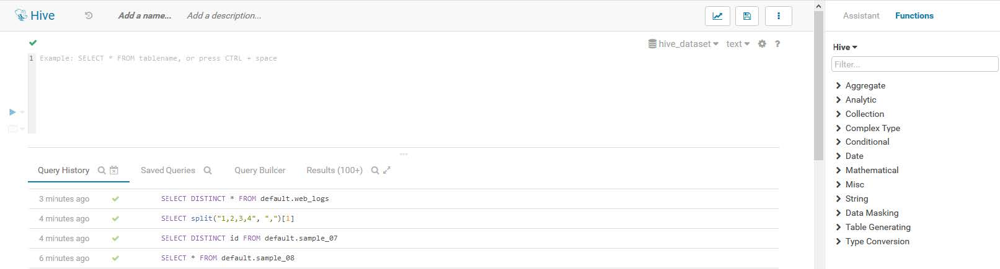
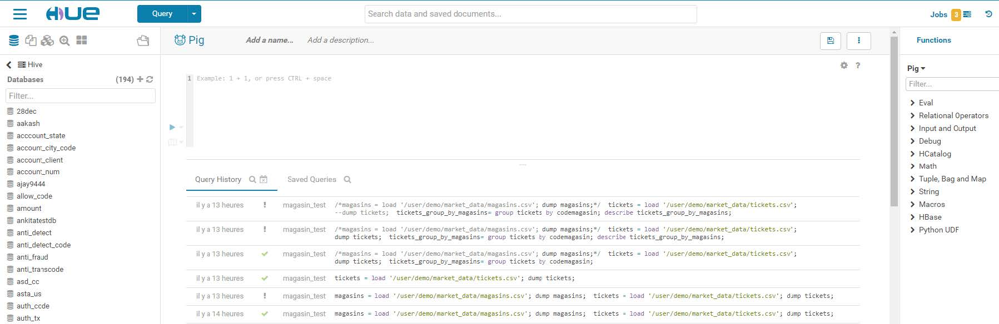
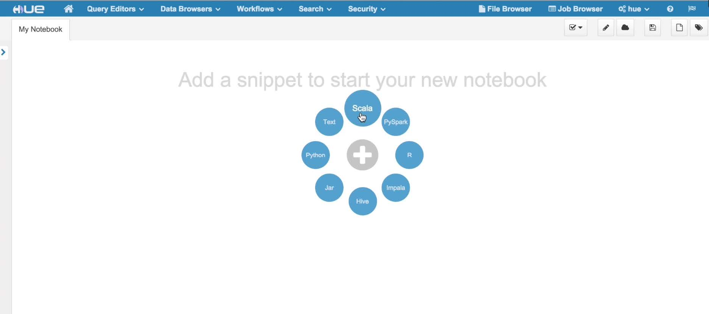
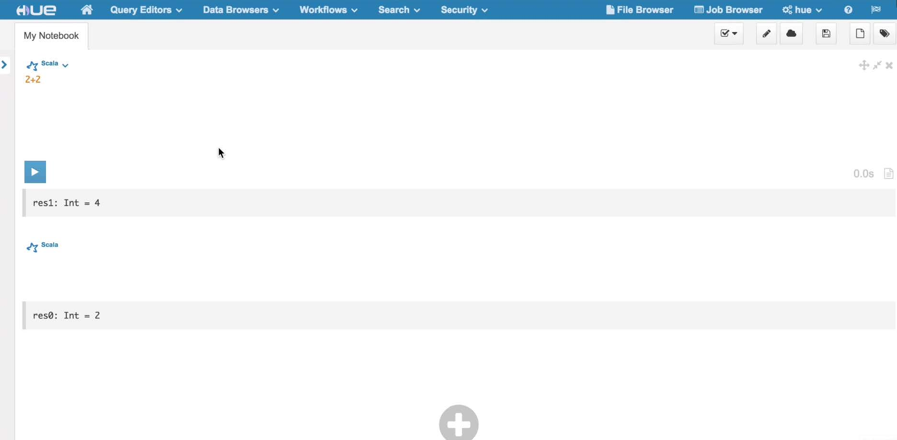
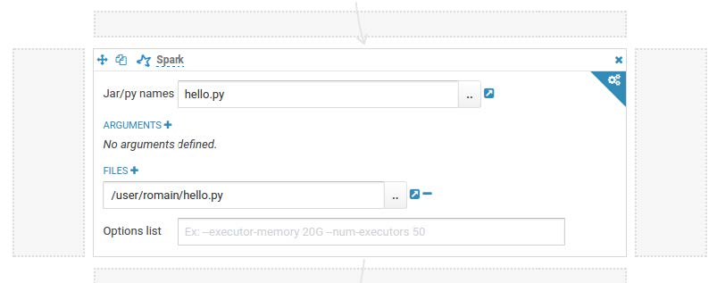
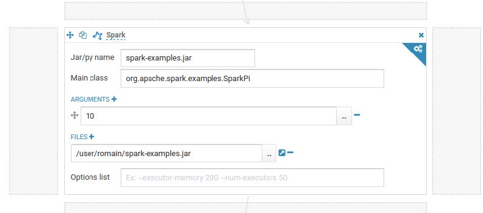

# Editors

------

First, in your hue.ini file, you will need to add the relevant database connection information under the librdbms section :

```
[librdbms]
  [[databases]]
    [[[postgresql]]]
    nice_name=PostgreSQL
    name=music
    engine=postgresql_psycopg2
    port=5432
    user=hue
    password=hue
    options={}
```

Secondly, we need to add a new interpreter to the notebook app. This will allow the new database type to be registered as a snippet-type in the Notebook app. For query editors that use a Django-compatible database, the name in the brackets should match the database configuration name in the librdbms section (e.g. – postgresql). The interface will be set to rdbms. This tells Hue to use the librdbms driver and corresponding connection information to connect to the database. For example, with the above postgresql connection configuration in the librdbms section, we can add a PostgreSQL interpreter with the following notebook configuration :

```
[notebook]
  [[interpreters]]
    [[[postgresql]]]
    name=PostgreSQL
    interface=rdbms
```

For any of the tasks you can add notebooks to modify Hue and make it more easy to use on your task.

## Running queries

------

> To run queries you must be logged to Hue as user that also have a Unix user account on the remote server

1. Write your query statement in the text pane

2. Click **Execute** or **Ctrl + Enter**. The query result window appears with you results

   - The logs are in the first window that appears during execution
   - Results are displayed in a window that appears
   - To view the columns of the query, expand the **Columns** icon. Clicking on the column label will scroll to the column. Names and types can be filtered
   - To expand a row, double click on it or click on the row number
   - To lock a row, click on the lock icon in the row number column
   - Search either by clicking on the magnifier icon on the results tab, or pressing Ctrl/Cmd + F

3. You can save your query in order to find it easily afterwards

   


## Downloading and saving query results

------

You can only save results to a file when the results were generated by a MapReduce job. This is the preferred way to save when the result is large (about > 1M rows).

To download your results you have several choices :

- Click **Download as CSV** to download the results in a comma-separated values file 
- Click **Download as XLS** to download the results in a Microsoft Office Excel worksheet file
- Click **Save** to save in a new table or in HDFS file
  - To save the results in a new table, select **In a new table**, enter a table name, and then click **Save**
  - To save the results in an HDFS file, select **In an HDFS directory**, enter a path and then click **Save**


## Advance query settings

------

In the top pane of the editor, you can find a lot of options :

**Database** : The database which contains the table definitions.

**Settings** :  Override default Hive and Hadoop settings. To configure a new setting, *click Add*, for Key enter a Hive or Hadoop variable name, and for value enter the value you want for this variable.

**File resources** : Make files locally accessible at query execution time on Hadoop cluster. Click *Add* to configure a new setting, from the *Type* drop-down menu, you can choose between different types :

- jar - Adds the specified resources to the java classpath
- archive - unarchive the specified resources when distributing them
- file - Adds the specified to the distributed cache
- path - Add the path to the file you want

**User-defined fonctions** : Specify user-defined functions. Click Add to configure a new setting. Specify the function name in the Name field, and specify the class name for Classname. 
You **must** specify a JAR file for the user-defined functions in FILE RESOURCES.
To include a user-defined function in a query, add a $ (dollar sign) before the function name in the query. 

**Parametrization** : Indicate that a dialog box should display to enter parameter values when a query containing the string $parametername is executed. Enabled by default.


## Jobs

------

The Editor application enables you to create and submit jobs to the cluster. A job has several parameters :

**Name** : Identifies the job

**Description** : A description of the job. The description is displayed in the dialog box that appears if you specify variable for the job

**Advanced** : Is-shared - Indicate whether to share the action with the other users 
​		    *Oozie* parameters - parameters to pass *Oozie*

**Prepare** : Specifies path to create or delete before starting the job workflow

**Job properties** : To set a property value click ***Add property***
​			    Property name - a configuration property name
​			    Value - The value of the property

**Files** : Files to pass to the job

**Archives** : Archives to pass to the job


## Tools for querying

------

### Hive

*Hive* is a tool powered with SQL-ish language HQL (Hive Query Language). You can write queries in HQL in the editor to interact with the databases and treat data in the cluster.

For using *Hive* you just have to select from the menu under the big blue button on the top left of the screen :



The editor for *Hive* appears. From left to right you have :

- The *Hive* database
- The writing pane and the query history below it. Below the pane you can also find the saved queries, the log and results will appear there.
- The assistant with preview of the table, a library of all the functions available in the editor and a suggestion zone for optimizing the queries



Hive will trigger a MapReduce job.


### Pig

------

It is pretty much the same thing for *Pig* except the fact that you only have the functions database and no assistant in the right pane.



A *Pig* script will result in a *Pig* job and will be run as it.


### Spark

------

*Spark* is a multi purpose tools, indeed it could do jobs executed on *YARN* but it also is a tool that could be used with the editor and which could be used to write scripts and jobs. 

*Spark* could interact with many different formats like *Python* with *PySpark*, *Scala* with *Spark for Scala*, *Java* and *Relational dabatase* for example. All this tools are either gathered in an app called notebook where you will be able to select which tools you want to used depending on the file format you want to work with.




The tools will be added as snipped in the notebook.



You can write your code in the snippets like you previously do in the editor.

For PySpark you have to upload you *.py* file to hue :




It is the same thing for Java or Scala, you have to upload the *.jar* :




