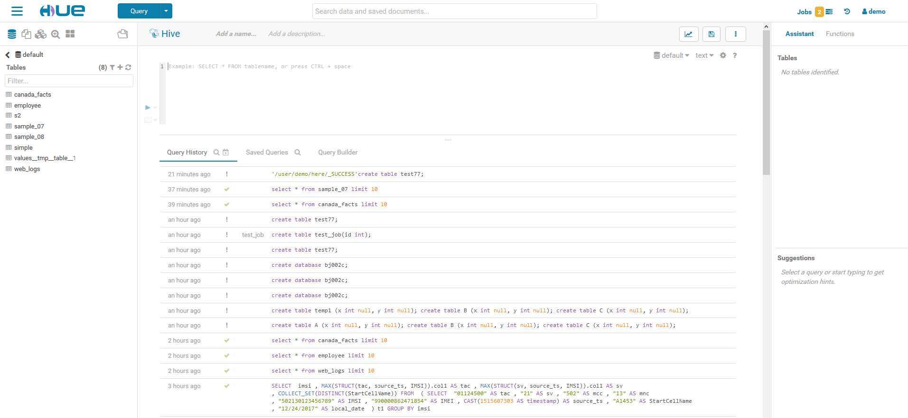

# Hue User Guide

------

This guide will helps you break trough the basis of Hue and use this knowledge to run the data analysis service through a user friendly interface.

## What is Hue

------

Hue is a single page service that allows you to perform data analyses in a simple way. 

You could import and browse your data very quickly and simply without losing your editor or anything else using the left pane which shows the hierarchy of the different data sources. You can also add some by just dragging and dropping in, it will trigger the "Creating table" wizard.

Once your data is on you will be able to query it. The Hue's editor embed auto completion for every languages you will most likely used like Pig Latin or HQL. The provided assistant offers previews and advices for the code that you are currently writing.

There are 4 applications :

- Editor : To make data querying easy and convenient. There is a powerful autocomplete, search and tagging assistant.
- Browsers : The browsers let you easily search, glance and perform actions on data or jobs 
- Dashboards : Dashboards are an interactive way to explore your data quickly and easily. No programming is required and the analysis is done by drag & drops and clicks.
- Scheduler: The application lets you build workflows and then schedule them to run regularly automatically. A monitoring interface shows the progress, logs and allow actions like pausing or stopping jobs.

The interface is a single page view and is divided in panes

You can see the different elements of the interface there :

- The top bar, with a quick action (big blue button), a global search and a notification area on the right
- A collapsible hamburger menu that offers links to the various apps and a quick way to import data
- An extended quick browse on the left
- The main app area
- A right Assistant panel for the current application

