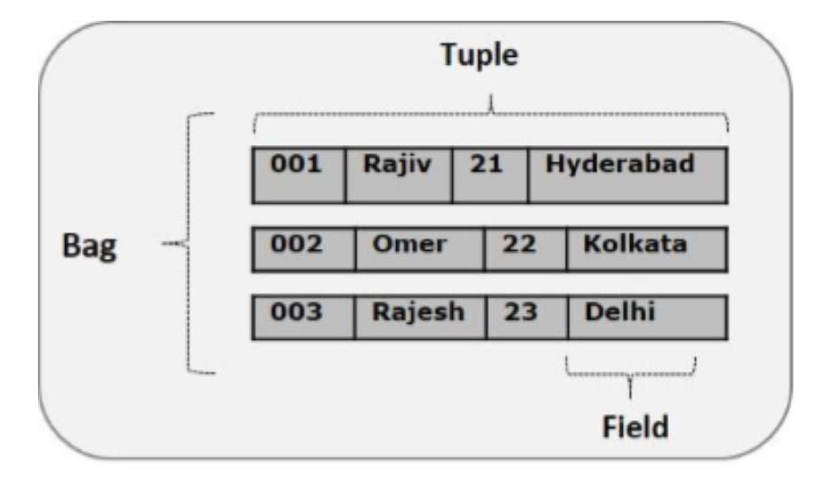

## Pig Latin Data models

The data models of Pig Latin is nested and allows complex non-atomic datatypes such as map and tuple. The different Data models are explained bellow.

### Atom (Field)

Any single value in Pig Latin, irrespective of their data, type is known as an Atom. It is stored as string and can be used as string and number. A piece of data or a simple atomic value is known as a **field**.

### Tuple

A record that is formed by an ordered set of fields is known as a tuple, the fields can be of any type.

### Bag

A bag is an unordered set of tuples. In other words, a collection of tuples is known as a bag. Each tuple can have any number of fields.

### Map

A map (or data map) is a set of key-value pairs. The **key** needs to be of type charArray and should be unique. The **value** might be of any type.

### Relation

A relation is a bag of tuples. The relations in Pig Latin are unordered (there is no guarantee that tuples are processed in any particular order).

## Pig Latin Data types

The tables bellow gives the pig Latin data types.

### Simple Types

| Data types | Description                              |
| ---------- | ---------------------------------------- |
| int        | Represents a signed 32-bit integer       |
| long       | Represents a signed 64-bit integer       |
| Biginteger | Represents a Java BigInteger             |
| float      | Represents a signed 32-bit floating point |
| double     | Represents a 64-bit floating point       |
| Bigdecimal | Represents a Java BigDecimal             |
| Boolean    | Represents a Boolean value               |
| chararray  | Represents a character array (string)    |
| Datetime   | Represents a date-time (Format Unix)     |
| Bytearray  | Represents a Byte array (blob)           |

### Complex Types

| Data types | Description                          |
| ---------- | ------------------------------------ |
| Tuple      | A tuple is an ordered set of fields. |
| Bag        | A bag is a collection of tuples.     |
| Map        | A Map is a set of key-value pairs.   |

### Null values

Values for all the above data types can be NULL. A null can be an unknown value or a non-existent value. These nulls can occur naturally or can be the result of an operation.