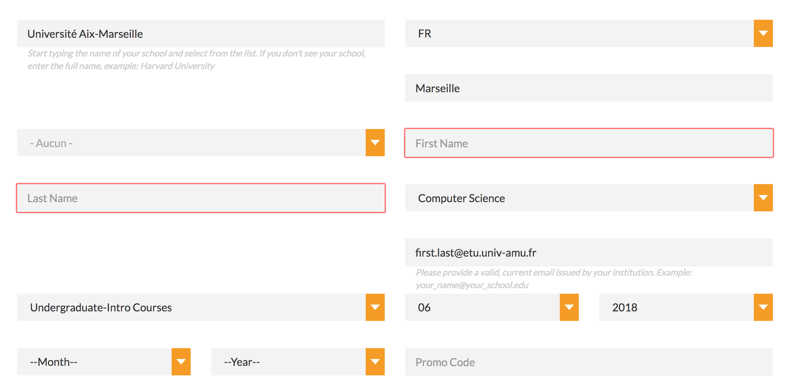
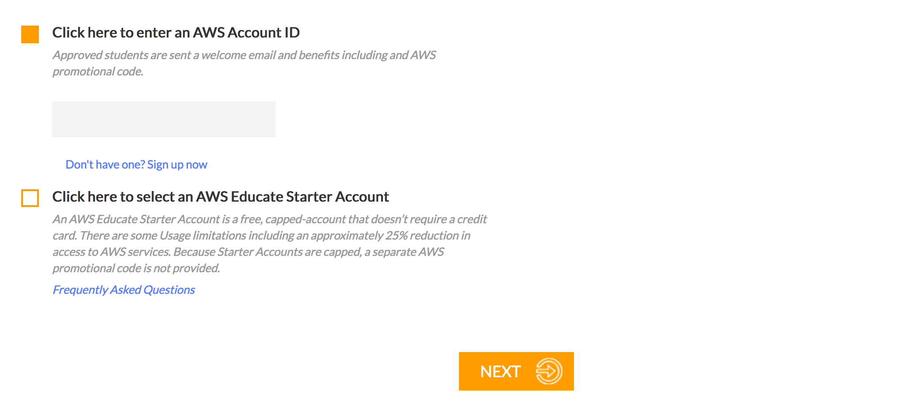

# AWS Educate

## Pre-Requisites

- an AWS account

## What is AWS Educate?

The AWS Educate program is Amazon’s global initiative to provide students and educators with the resources needed to greatly accelerate Cloud-related learning endeavors and to help power the workforce of tomorrow. AWS Educate provides grant-based access to AWS, training, and content, while also providing educators and students with a forum for collaboration.

##What benefits?

Our university, Aix-Marseille University [is a member](https://s3.amazonaws.com/awseducate-list/AWS_Educate_Institutions.pdf#page=55) of AWS Educate, hence we have **$100 credits each year**. 

## Compare

Two ways to access AWS Educate: an AWS account or an AWS Educate Starter account.

|                                        | AWS                  | AWS Educate Starter                     |
| -------------------------------------- | -------------------- | --------------------------------------- |
| Credit card                            | Required             | None                                    |
| Run by                                 | Amazon               | qwikLABs                                |
| Persistence after credits expire       | Yes                  | No, account closed and services deleted |
| Can use all AWS services               | Yes                  | No                                      |
| Renewal every year                     | Yes                  | Yes                                     |
| No pending time after account creation | No, review (max 48h) | Yes                                     |
| Credits                                | 100$                 | 75$                                     |
| AWS Free Tier eligible                 | Yes                  | No                                      |
| Account linked with others             | Yes                  | No                                      |
| Can use promo code                     | Yes                  | No                                      |

For our project it's best to use a regular AWS account. The choice is yours.

## How to

Go to https://www.awseducate.com/registration.

Choose **Student**.

Fill the application with your information.

Choose **Université Aix-Marseille** in the list and provide your university email **@univ-amu.fr**.

Next page, you'll have to choose between AWS account and AWS Educate Starter account.

I personally recommand to choose a regular AWS account. In order to do that, you will need to provide the **AWS Account ID**. You can find it in your dashboard, [right here](https://console.aws.amazon.com/billing/home?#/account).

You will receive an email to verify your application within minutes.

And that's it! You're application is now under review! Should take 48h max, mine took 5min.

## Cash the credits

When your AWS Educate application has been approved, you will receive an email, containing your **AWS Promotional Credit** and the instructions to redeem it on your AWS Account.

And that's it! 

### Piece of advice

To save your credits, do not forget to stop your instances when you do not use them. 💰