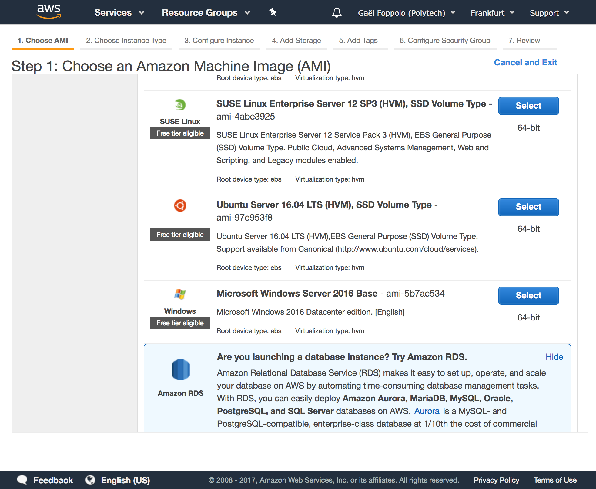
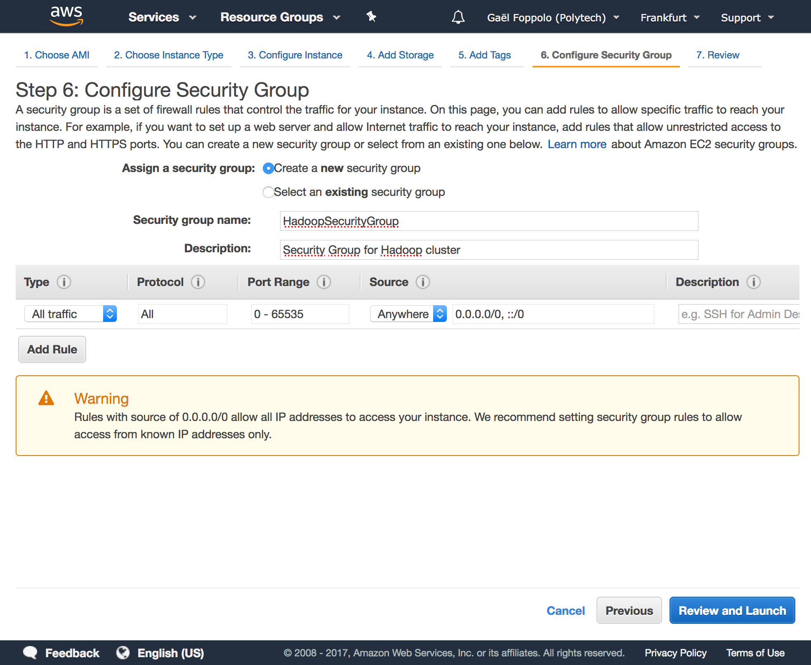
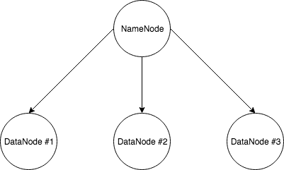

# AWS

## Pre-Requisites

- an AWS account
- OpenSSH installed or any SSH client

## Setup AWS instances

We are going to create EC2 instances using the latest Ubuntu Server as OS.

###Select instance

Go to AWS Console, choose the EC2 service. On the EC2 Dashboard, click on **Launch Instance**. You can check *Free tier only* if you like. In the list select the latest Ubuntu Server. Currently, it's 16.04 LTS.



### Instance type

Choose the **t2.micro** instance type. It is enough for our purposes at the moment. Click on *Next: Configure Instance Details*.

Change the number of instance to 4 and choose a subnet. The last option is useful if we want to scale manually our cluster later. Leave others options as they are. Click on *Next: Add Storage*.


### Storage

Default is 8Gb, and it's fine for our purpose at the moment. We can increase the size of the EBS volume later so that's ok.

Also don't forget to uncheck **Delete on Termination** as we want to keep our data after stopping our EC2 instances.


Click on *Next: Add Tags*.

### Tags

A tag allows to identify an instance with a name. Click *Add Tag*, set the **Key** to *Name* and **Value** to *Hadoop*. We will use this tag to re-label our instances later on. 

Click on *Next: Configure Security Group*.

### Security Group

This step lets us define rules regarding the incoming or outgoing access of the instances.

Select *Create a new security group* name it as you like (eg: *HadoopSecurityGroup*) and give it a useful description. For the purpose of testing, we are going to open everything to avoid network errors. Configure as the following image:



*todo: configure the security group with restricting rules*

Finally, click on *Review and Launch*.

Review the information again and click *Launch* to start the instances. 

## Key pair

We need to create a key pair in order to connect to our instances securely, here throught SSH.

Select *Create a new key pair* from the first dropbox, give a name to the key pair (eg: *hadoopec2cluster*) and download it. As mentioned on the AWS Console, we will not be able to download the file again after it's created, so save it in a secure location. You can store it in the **keys** folder of this repository, it will not be committed.

Click on *Launch*. On the next page, you can directly click on *View Instances* where we are going to rename our instances.

### Renaming

Rename the instances as follow:

- HadoopNameNode (Master)
- HadoopDataNode1 (Slave #1)
- HadoopDataNode2 (Slave #2)
- HaddopDataNode3 (Slave #3)

## SSH configuration

###First connection

To connect to our instances we use SSH. On the *AWS Console*, retrieve the *Public DNS*, should be something like: **ec2-19-124-171-90.eu-central-1.compute.amazonaws.com**.

The default user is **ubuntu** on Ubuntu AMI OS. You can either use a GUI client or a terminal. With a terminal, use this command to connect: 

```sh
ssh -i path/to/your/key.pem ubuntu@ec2-19-124-171-90.eu-central-1.compute.amazonaws.com
```

*Note*: if you see a message like this, it is because the key you're trying to use is too accessible to users on the system. You need to restrict the access by simply run the following command: `chmod 600 path/to/your/key.pem`


Try to connect to each instances, to see if everything goes smoothly.

### Files transfer

In order to transfer files easily,  we are going to use SFTP, SSH for file transfer. We can use a GUI client such as FileZilla.  Add a *New Site* in FileZilla and configure as follow with the *Public DNS* and the key. Configure others settings as you like.


### Instance communication

At the moment, we can connect to all our instances/nodes but the nodes themselves cannot communicate between them. Indeed, Hadoop and all the associate components (YARN, HDFS, etc.) communicate throught SSH. We need to allow the master node (NameNode) to access to the slaves nodes (DataNode).

But accessing via SSH requires a password, so in order to avoid having to type the password for each SSH access to nodes in the cluster, we are going to set a password-less SSH access. SSH to the master node (NameNode) and type the following commands:

```sh
# generate keys file (public and private)
ssh-keygen -t rsa -P '' -f ~/.ssh/id_rsa
# add the public key in the list of the authorized keys
cat ~/.ssh/id_rsa.pub >> ~/.ssh/authorized_keys
```

Now, we need to copy the public key (`id_rsa.pub`) from the NameNode to each DataNode. You can use the SFTP client to do that. Finally, append the contents to `~/.ssh/authorized_keys` on each data node, by using the second command.

#### SSH config

SSH uses a configuration file located at `~/.ssh/config` for various parameters. You can find a template of this file in the **keys** folder. Set it up by substitute each node’s *Private DNS* for the HostName parameter.

Why *Private DNS* instead of *Public DNS*? *Public DNS* changes every time you stop and then start your instance. *Private DNS* doesn't. Thanks to this trick communication will work even after stop/start.

To enable simple instances interaction, we are going to add a quick *config* file. You can find a template file in the **keys** folder. Simply replace the hostnames with the *Private DNS* and the change the path of the *.pem* file if needed. 

We need to copy this file in `~/.ssh/` folder of the NameNode. Only the master will have the private key, so only him will be able to SSH to slave nodes, and so only him can really use this file.



To try, from the NameNode, simply: `ssh datanode1` and that's it!