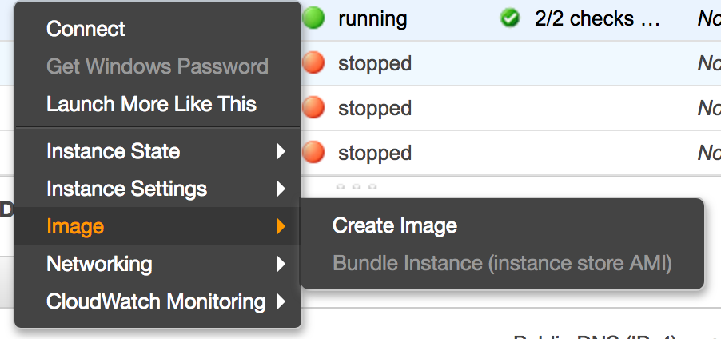

# Amazon Managed Image

## Pre-Requisites

- an AWS account
- a instance template, or that you want to save

## Create the AMI

Let's create an image of this template.

Back on AWS Console, in the list of EC2 instances, select the instance you want to save, right-click on it and select **Create an image**.

Give an distinguish name and description to your instance and click **Create Image**. You can see your AMI (Amazon Machine Image) just like instances by clicking to **AMIs** on the left menu.

Wait until the status of your image is **available**.

## Use the AMI

We now have our image. Let's use it. Two ways.

- from the list of your AMIs: select the AMI and click **Launch**. You can then change the details like any instance before launching.
- from EC2 instances list: when you choose the OS, on the left side you can select **My AMIs** and chose your image