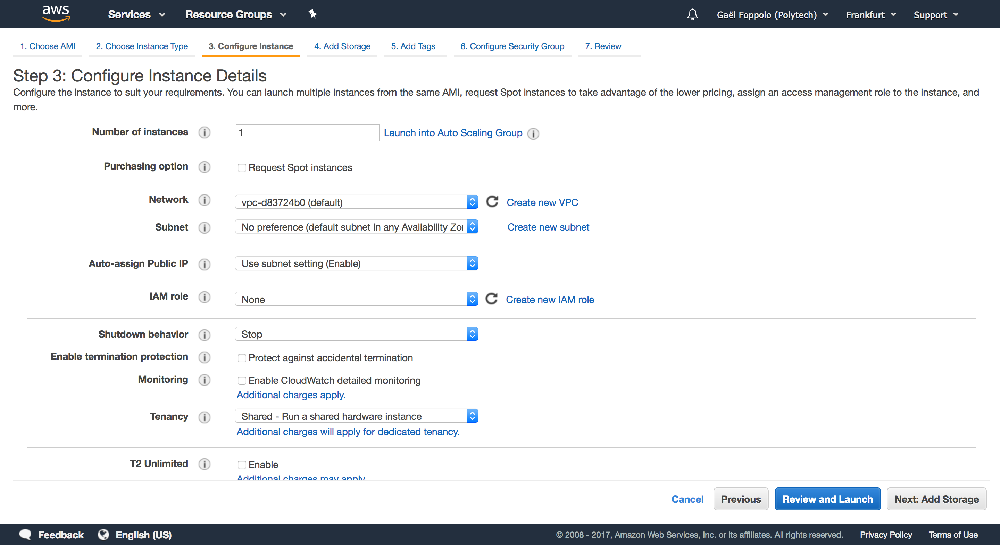
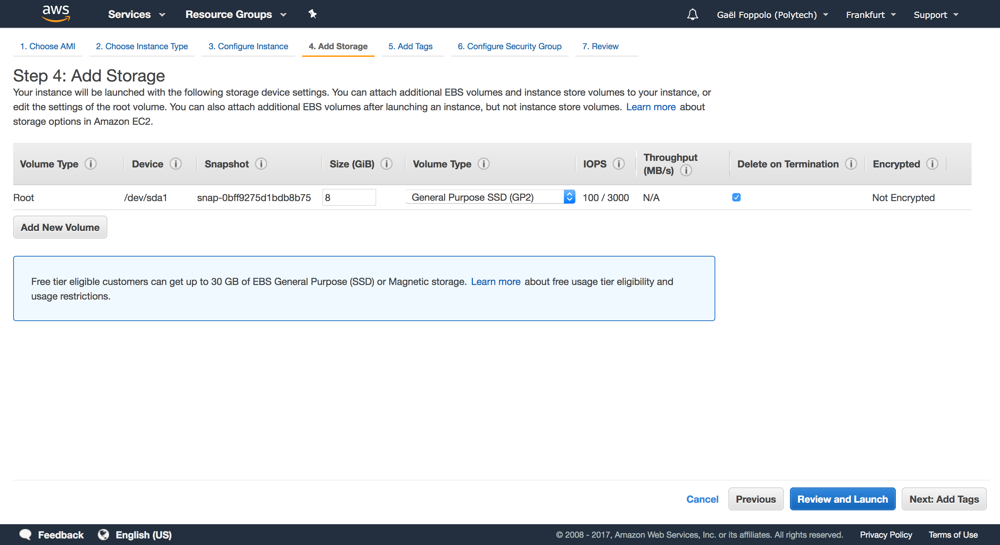
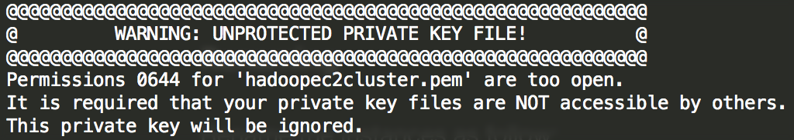
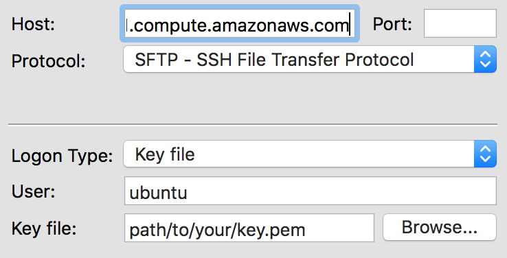

# AWS

## Pre-Requisites

- an AWS account
- OpenSSH installed or any SSH client

## Setup AWS instances

We are going to create an EC2 instance using the latest Ubuntu Server as OS.

###Select instance

Go to AWS Console, choose the EC2 service. On the EC2 Dashboard, click on **Launch Instance**. You can check *Free tier only* if you like. In the list select the latest Ubuntu Server. Currently, it's 16.04 LTS.


### Instance type

Choose the **t2.micro** instance type. It is enough for our purposes at the moment. Click on *Next: Configure Instance Details*.

Choose a subnet. The last option is useful if we want to scale manually our cluster later. Leave others options as they are. Click on *Next: Add Storage*.



### Storage

Default is 8Gb, and it's fine for our purpose at the moment. We can increase the size of the EBS volume later so that's ok.



_Note_: you can also uncheck **Delete on Termination** if you want to keep your data after terminating the EC2 instance.

Click on *Next: Add Tags*.

### Tags

A tag allows to identify an instance with a name. Click *Add Tag*, set the **Key** to *Name* and **Value** to *Hadoop*. We will use this tag to re-label our instances later on. 

Click on *Next: Configure Security Group*.

### Security Group

This step lets us define rules regarding the incoming or outgoing access of the instances.

Select *Create a new security group* name it as you like (eg: *HadoopSecurityGroup*) and give it a useful description. For the purpose of testing, we are going to open everything to avoid network errors. Configure as the following image:


*todo: configure the security group with restricting rules*

Finally, click on *Review and Launch*.

Review the information again and click *Launch*.

## Key pair

We need to create a key pair in order to connect to our instance securely, here through SSH.

Select *Create a new key pair* from the first dropbox, give a name to the key pair (eg: *hadoopec2cluster*) and download it. As mentioned on the AWS Console, we will not be able to download the file again after it's created, so save it in a secure location. You can store it in the **keys** folder of this repository, it will not be committed.

Click on *Launch*. On the next page, you can directly click on *View Instances*. Wait until the status of the instance is **running**. 

## First connection

To connect to our instance we use SSH. On the *AWS Console*, retrieve the *Public DNS*, should be something like: **ec2-19-124-171-90.eu-central-1.compute.amazonaws.com**.

The default user is **ubuntu** on Ubuntu AMI OS. You can either use a GUI client or a terminal. With a terminal, use this command to connect: 

```sh
ssh -i path/to/your/key.pem ubuntu@ec2-19-124-171-90.eu-central-1.compute.amazonaws.com
```

*Note*: if you see a message like this, it is because the key you're trying to use is too accessible to users on the system. You need to restrict the access by simply run the following command: `chmod 600 path/to/your/key.pem`



## Files transfer

### SFTP

In order to transfer files easily,  we cane use SFTP, SSH for file transfer. We can use a GUI client such as FileZilla.  Add a *New Site* in FileZilla and configure as follow with the *Public DNS* and the key. Configure others settings as you like.



### SCP

We can also use `scp` if you want to avoid GUI. From terminal you can use:

```sh
# download remote file to current local folder
scp -i key.pem ubuntu@<public DNS>:path/to/file .
# upload local file to remote folder
scp -i key.pem path/to/file ubuntu@<public DNS>:path/to/folder
```

And that's it, you created your first EC2 instance on AWS! :tada: