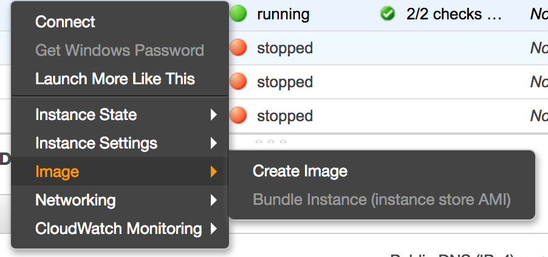
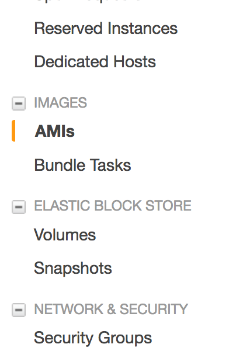
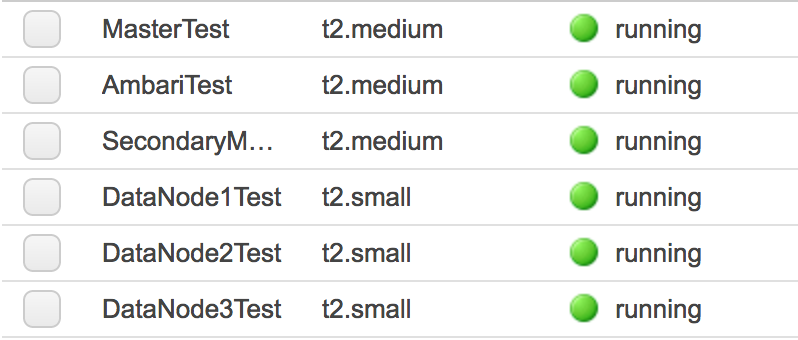
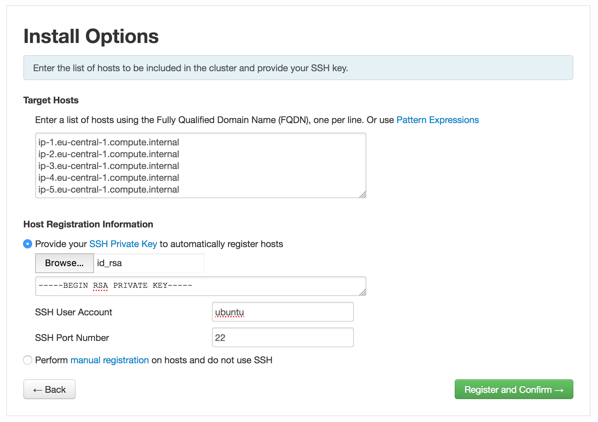

# Ambari on AWS

How to install Ambari on AWS and deploy/manage your Hadoop cluster.

## Pre-Requisites

- 01-AWS completed
- OpenSSH installed or any SSH client

## What will we do?

First we are going to create the Ambari server, that will manage the cluster, and install the components for us. Then we will create a template of slave, that we will replicate and where we will install the components.

## What will we need?

To start small, we will need **6 EC2 instances**, running **Ubuntu Server 16.04 LTS**. Don't create them now, but keep this table for future reference.

|     Purpose     |   Type    | Storage |
| :-------------: | :-------: | :-----: |
|     Ambari      | t2.medium |  15Gb   |
|     Master      | t2.medium |  15Gb   |
| SecondaryMaster | t2.medium |  15Gb   |
|    DataNode1    | t2.small  |  15Gb   |
|    DataNode2    | t2.small  |  15Gb   |
|    DataNode3    | t2.small  |  15Gb   |

## Ambari Server

Create the instance, according to the specs in the table. SSH into it and run the following commands:

```sh
# install requirements
sudo apt-get install curl
sudo apt-get install unzip
sudo apt-get install openssl
sudo apt-get install tar
sudo apt-get install wget
sudo apt-get install python
sudo apt-get install ntp
# configure ntp
sudo update-rc.d ntp defaults
sudo update-rc.d ntp enable
sudo /etc/init.d/ntp start
# add the repo & update
sudo wget -O /etc/apt/sources.list.d/ambari.list http://public-repo-1.hortonworks.com/ambari/ubuntu16/2.x/updates/2.6.0.0/ambari.list
sudo apt-key adv --recv-keys --keyserver keyserver.ubuntu.com B9733A7A07513CAD
sudo apt-get update
# install the server
sudo apt-get install ambari-server
```

Confirm the download. Then launch the setup with:

```sh
sudo ambari-server setup
```

| Question                                 | Response |
| ---------------------------------------- | -------- |
| Customize user account for ambari-server daemon | n        |
| Enter choice                             | 1        |
| License                                  | y        |
| Enter advanced database configuration    | n        |

By default Ambari uses port 8080 for access to Ambari (Web and REST API). Personnaly, I prefer to use the regular web port, 80. If you wish to change the port number, you need to edit the Ambari properties file, by adding the property `client.api.port=80`:

```sh
echo "client.api.port=80" | sudo tee -a /etc/ambari-server/conf/ambari.properties
```

Finally launch the server with:

```sh
sudo ambari-server start
```

Wait that the launch complete with success.

## The clients

We are going to create a template instance, that we can replicate, and dodge the painless initial setup for each client.

First, create an instance, with the type you want (eg:  t2.micro), running **Ubuntu Server 16.04 LTS**.

SSH into it and run the following commands:

```sh
# add key and update
sudo apt-key adv --recv-keys --keyserver keyserver.ubuntu.com B9733A7A07513CAD
sudo apt-get update
# install requirements
sudo apt-get install ntp
sudo apt-get install python
# configure ntp
sudo update-rc.d ntp defaults
sudo update-rc.d ntp enable
sudo /etc/init.d/ntp start
```

### SSH communication

At the moment, we can connect to all our instances/nodes but the nodes themselves cannot communicate between them. Indeed, Ambari Server communicate throught SSH. We need to allow the Ambari Server node to access to the slaves nodes (with Ambari Agents).

Also Ambari Server need a password-less SSH access to work. On the Ambari Server type the following command:

```sh
# generate keys file (public and private)
ssh-keygen -t rsa -P '' -f ~/.ssh/id_rsa
```

Now, we need to copy the public key (`id_rsa.pub`) from the Ambari Server to the template slave node. You can use the `scp` to do that. After closing the SSH connection:

```sh
scp -i key.pem ubuntu@<public DNS ambari server>:~/.ssh/id_rsa.pub .
# also copy the private key, we need it later
scp -i key.pem ubuntu@<public DNS ambari server>:~/.ssh/id_rsa .
```

Then copy this to the template slave node:

```sh
scp -i key.pem id_rsa.pub ubuntu@<public DNS slave node>:~/.ssh/
```

Finally, append the contents to `~/.ssh/authorized_keys` on the template slave node, by using:

```sh
cat ~/.ssh/id_rsa.pub >> ~/.ssh/authorized_keys
```

We now have our template. Let's create an image of this template.

Back on AWS Console, in the list of instances, select the one we just configure (our template), right-click on it and select **Create an image**.



Give an distinguish name and description to your instance and click **Create Image**. You can see your AMI (Amazon Machine Image) just like instances by clicking to **AMIs** on the left menu.



Wait until the status of your image is **available**.

Then create a new instance by selecting the AMI and click **Launch**. You can also create the instance from the EC2 instances list.

According to the specs in the table, create the instances we need (2 master and 3 data nodes).

Do not forget to remove the instance template. You should have something like this:



We have all our nodes, we can now begin the real install!

## Install the cluster

In this part, we are only going to use the browser, we are done with the terminal.

We can access the Ambari Install Wizard through the browser, to `http://<public DNS of your Ambari server>`.

We should now be on the login page of Ambari Server. Log in using the default username/password: **admin/admin**. We can change this later to whatever we wish.


Click **Launch Install Wizard**.

Choose the name of your cluster.

On the next page, **Select Version**, no need to modify anything, simply go **Next**.

On **Install Options**, we need to fill a couple of information:

- Target Hosts: enter the **private DNS** of each slave nodes, one per line
- Host Registration Information: select the private key (`id_rsa`) we downloaded before.
- SSH User Account: change to `ubuntu`



Click **Register and Confirm** to continue.

Wait during the registering process. At a couple of minutes, the status of all host should be **Success**. Click **Next**.

### Services

On the next page, we choose the services we want to install in our cluster. Don't worry we will be able to add new service after initial setup. For starter, only select the following services:

- HDFS
- YARN + MapReduce2
- ZooKeeper
- Ambari Infra
- Ambari Metrics

Click **Next** to confirm the selection.

### Master

On the next page, we assign master components to hosts you want to run them on.

I recommand to split on the two masters instances (Master and SecondaryMaster) first. We can review this assignment if needed in the future.

|          Services          |      Where      |
| :------------------------: | :-------------: |
|         SNameNode          | SecondaryMaster |
|          NameNode          |     Master      |
| App Timeline Server (YARN) |     Master      |
|      ResourceManager       |     Master      |
| History Server (MapReduce) |     Master      |
|      ZooKeeper Server      |     Master      |
|    Infra Solr Instance     | SecondaryMaster |
|     Metrics Collector      | SecondaryMaster |
|          Grafana           | SecondaryMaster |
|     Activity Analyzer      | SecondaryMaster |
|     Activity Explorer      | SecondaryMaster |
|         HST Server         | SecondaryMaster |

When you are satisfied with the assignments, choose **Next**.

## Slaves

On the next page, we assign slave components to hosts you want to run them on.

I recommand to install on the three instances that we choose to be our data nodes (without the *✵* in the list):

- DataNode
- NodeManager
- Client

Click **Next** to continue.

## Customize Services

todo

##Test Hadoop

sudo su

sudo hfs

`/usr/hdp/2.6.3.0-235/hadoop-mapreduce`

`hadoop jar /usr/hdp/2.6.3.0-235/hadoop-mapreduce/hadoop-mapreduce-examples-2.7.3.2.6.3.0-235.jar pi 15 1000`